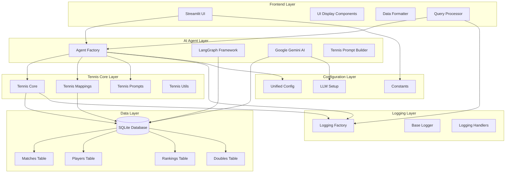
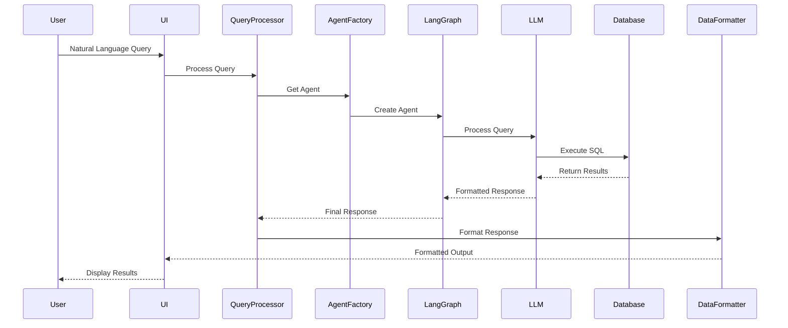

# 🏗️ AskTennis AI - System Architecture

## Overview

AskTennis AI is a comprehensive tennis analytics platform built with a modular, microservices-inspired architecture. The system leverages Google Gemini AI, LangGraph framework, and a comprehensive tennis database to provide natural language querying of 147 years of tennis history.

## 🎯 System Architecture Diagram

### **Visual Architecture Overview**
```
┌─────────────────────────────────────────────────────────────────┐
│                        FRONTEND LAYER                          │
├─────────────────────────────────────────────────────────────────┤
│  Streamlit UI  │  UI Display  │  Data Formatter  │  Query     │
│                │  Components  │                  │  Processor │
└─────────────────────────────────────────────────────────────────┘
                                │
                                ▼
┌─────────────────────────────────────────────────────────────────┐
│                        AI AGENT LAYER                          │
├─────────────────────────────────────────────────────────────────┤
│  Agent Factory  │  LangGraph   │  Google Gemini  │  Tennis    │
│                 │  Framework   │  AI             │  Prompt     │
│                 │              │                 │  Builder   │
└─────────────────────────────────────────────────────────────────┘
                                │
                                ▼
┌─────────────────────────────────────────────────────────────────┐
│                       TENNIS CORE LAYER                        │
├─────────────────────────────────────────────────────────────────┤
│  Tennis Core  │  Tennis      │  Tennis       │  Tennis Utils │
│               │  Mappings    │  Prompts      │               │
└─────────────────────────────────────────────────────────────────┘
                                │
                                ▼
┌─────────────────────────────────────────────────────────────────┐
│                         DATA LAYER                             │
├─────────────────────────────────────────────────────────────────┤
│  SQLite Database  │  Matches  │  Players  │  Rankings  │  Doubles │
│                   │  Table    │  Table    │  Table     │  Table   │
└─────────────────────────────────────────────────────────────────┘
                                │
                                ▼
┌─────────────────────────────────────────────────────────────────┐
│                       LOGGING LAYER                            │
├─────────────────────────────────────────────────────────────────┤
│  Logging Factory  │  Base Logger  │  Logging Handlers          │
└─────────────────────────────────────────────────────────────────┘
                                │
                                ▼
┌─────────────────────────────────────────────────────────────────┐
│                    CONFIGURATION LAYER                         │
├─────────────────────────────────────────────────────────────────┤
│  Unified Config  │  Constants  │  LLM Setup                     │
└─────────────────────────────────────────────────────────────────┘
```

### **Component Interaction Flow**
```
User Input → Streamlit UI → Query Processor → Agent Factory
     │                                           │
     ▼                                           ▼
UI Display ← Data Formatter ← AI Response ← LangGraph Agent
     │                                           │
     ▼                                           ▼
User Output ← Formatted Response ← Database Query ← Tennis Core
```

### **Mermaid Diagram (for supported viewers)**


## 🧩 Core Components

### 1. **Frontend Layer**
- **Streamlit UI**: Main user interface
- **UI Display**: Component rendering and user interaction
- **Data Formatter**: Response formatting and presentation
- **Query Processor**: User query handling and processing

### 2. **AI Agent Layer**
- **Agent Factory**: Creates and configures the LangGraph agent
- **LangGraph Framework**: Stateful AI agent orchestration
- **Google Gemini AI**: Large Language Model for natural language processing
- **Tennis Prompt Builder**: Specialized prompts for tennis queries

### 3. **Tennis Core Layer**
- **Tennis Core**: Main tennis functionality orchestrator
- **Tennis Mappings**: Terminology and mapping tools
- **Tennis Prompts**: Specialized tennis query prompts
- **Tennis Utils**: Utility functions and performance monitoring

### 4. **Data Layer**
- **SQLite Database**: Primary data storage
- **Matches Table**: 1.7M+ singles matches (1877-2024)
- **Players Table**: 136K+ players with metadata
- **Rankings Table**: 5.3M+ ranking records (1973-2024)
- **Doubles Table**: 26K+ doubles matches (2000-2020)

### 5. **Logging Layer**
- **Logging Factory**: Centralized logging management
- **Base Logger**: Core logging functionality
- **Specialized Handlers**: Query, response, error, and database logging

### 6. **Configuration Layer**
- **Unified Config**: Centralized configuration management
- **Constants**: Application constants and settings
- **LLM Setup**: Language model configuration

## 🔄 Data Flow Architecture



## 🏗️ Architectural Patterns

### 1. **Modular Architecture**
- **Separation of Concerns**: Each module has a specific responsibility
- **Loose Coupling**: Components interact through well-defined interfaces
- **High Cohesion**: Related functionality is grouped together

### 2. **Factory Pattern**
- **Agent Factory**: Creates and configures AI agents
- **LLM Factory**: Manages language model setup
- **Logging Factory**: Centralized logging management

### 3. **Builder Pattern**
- **LangGraph Builder**: Constructs the AI agent graph
- **Prompt Builder**: Creates specialized tennis prompts

### 4. **Strategy Pattern**
- **Data Formatters**: Different formatting strategies for different data types
- **Mapping Tools**: Various mapping strategies for tennis terminology

## 🚀 Performance Optimizations

### 1. **Caching Strategy**
- **Streamlit Caching**: `@st.cache_resource` for agent initialization
- **LRU Caching**: Cached mapping functions with `@lru_cache`
- **Database Indexing**: 15 optimized indexes for fast queries

### 2. **Database Optimization**
- **Indexed Queries**: Optimized for common query patterns
- **View Optimization**: Pre-computed views for complex queries
- **Connection Pooling**: Efficient database connection management

### 3. **AI Optimization**
- **Tool Binding**: Pre-bound tools to LLM for faster execution
- **Prompt Optimization**: Specialized prompts for tennis queries
- **Response Caching**: Cached responses for repeated queries

## 🔧 Configuration Management

### 1. **Unified Configuration**
```python
class UnifiedAgentConfig:
    def __init__(self):
        self.api_key = os.getenv('GEMINI_API_KEY')
        self.database_path = 'tennis_data.db'
        self.model_name = 'gemini-2.5-flash-lite'
```

### 2. **Environment Variables**
- `GEMINI_API_KEY`: Google Gemini API key
- `DATABASE_PATH`: SQLite database file path
- `LOG_LEVEL`: Logging level configuration

### 3. **Runtime Configuration**
- **Agent Configuration**: Dynamic agent setup based on environment
- **Database Configuration**: Flexible database connection settings
- **Logging Configuration**: Configurable logging levels and handlers

## 🛡️ Error Handling & Resilience

### 1. **Graceful Degradation**
- **Agent Initialization**: Fallback mechanisms for agent creation
- **Database Connectivity**: Error handling for database connection issues
- **API Failures**: Retry mechanisms for external API calls

### 2. **Comprehensive Logging**
- **Query Logging**: Track all user queries and responses
- **Error Logging**: Detailed error tracking and debugging
- **Performance Logging**: Monitor system performance metrics

### 3. **Validation & Sanitization**
- **Input Validation**: Validate user queries before processing
- **SQL Injection Prevention**: Parameterized queries and input sanitization
- **Response Validation**: Ensure response quality and accuracy

## 📊 Scalability Considerations

### 1. **Horizontal Scaling**
- **Stateless Design**: Components can be scaled independently
- **Database Sharding**: Potential for database partitioning
- **Load Balancing**: Multiple agent instances for high availability

### 2. **Vertical Scaling**
- **Memory Optimization**: Efficient memory usage for large datasets
- **CPU Optimization**: Parallel processing for complex queries
- **Storage Optimization**: Efficient data storage and retrieval

### 3. **Performance Monitoring**
- **Real-time Metrics**: Monitor system performance in real-time
- **Bottleneck Identification**: Identify and resolve performance bottlenecks
- **Capacity Planning**: Plan for future growth and scaling needs

## 🔮 Future Architecture Enhancements

### 1. **Microservices Architecture**
- **Service Decomposition**: Break down into smaller, focused services
- **API Gateway**: Centralized API management
- **Service Discovery**: Dynamic service registration and discovery

### 2. **Cloud-Native Design**
- **Containerization**: Docker containers for deployment
- **Orchestration**: Kubernetes for container orchestration
- **Cloud Services**: Leverage cloud-native services for scalability

### 3. **Advanced AI Integration**
- **Multi-Model Support**: Support for multiple LLM providers
- **Fine-tuning**: Custom model fine-tuning for tennis-specific queries
- **Ensemble Methods**: Multiple AI models for improved accuracy

## 📈 Monitoring & Observability

### 1. **Application Metrics**
- **Query Performance**: Track query execution times
- **Response Quality**: Monitor response accuracy and relevance
- **User Engagement**: Track user interaction patterns

### 2. **System Metrics**
- **Resource Utilization**: CPU, memory, and storage usage
- **Database Performance**: Query performance and optimization
- **API Performance**: External API response times and reliability

### 3. **Business Metrics**
- **User Satisfaction**: Track user feedback and satisfaction
- **Query Success Rate**: Monitor successful query completion
- **Feature Usage**: Track which features are most used

---

## 🎯 Key Architectural Benefits

1. **Modularity**: Easy to maintain and extend individual components
2. **Scalability**: Designed to handle growing data and user base
3. **Performance**: Optimized for fast query processing and response
4. **Reliability**: Robust error handling and graceful degradation
5. **Maintainability**: Clean code structure and comprehensive documentation
6. **Testability**: Individual components can be tested in isolation
7. **Flexibility**: Easy to add new features and capabilities

This architecture provides a solid foundation for a comprehensive tennis analytics platform that can scale with growing data and user demands while maintaining high performance and reliability.
