# 🏗️ AskTennis AI - System Architecture

## Overview

AskTennis AI is a comprehensive tennis analytics platform built with a modular, microservices-inspired architecture. The system leverages Google Gemini AI, LangGraph framework, and a comprehensive tennis database to provide natural language querying of 147 years of tennis history.

## 🎯 System Architecture Diagram

### **Visual Architecture Overview**
```
┌─────────────────────────────────────────────────────────────────┐
│                        FRONTEND LAYER                          │
├─────────────────────────────────────────────────────────────────┤
│  Streamlit UI  │  UI Display  │  Data Formatter  │  Query     │
│  (Basic/Enhanced) │  Components  │                  │  Processor │
└─────────────────────────────────────────────────────────────────┘
                                │
                                ▼
┌─────────────────────────────────────────────────────────────────┐
│                        AI AGENT LAYER                          │
├─────────────────────────────────────────────────────────────────┤
│  Agent Factory  │  LangGraph   │  Google Gemini  │  Tennis    │
│                 │  Framework   │  AI             │  Prompt     │
│                 │              │                 │  Builder   │
└─────────────────────────────────────────────────────────────────┘
                                │
                                ▼
┌─────────────────────────────────────────────────────────────────┐
│                       TENNIS CORE LAYER                        │
├─────────────────────────────────────────────────────────────────┤
│  Tennis Core  │  Mapping      │  Mapping      │  Tennis       │  Ranking      │
│               │  Dicts        │  Tools        │  Prompts      │  Analysis     │
└─────────────────────────────────────────────────────────────────┘
                                │
                                ▼
┌─────────────────────────────────────────────────────────────────┐
│                         DATA LAYER                             │
├─────────────────────────────────────────────────────────────────┤
│  SQLite Database  │  Matches  │  Players  │  Rankings  │  Doubles │
│                   │  Table    │  Table    │  Table     │  Table   │
└─────────────────────────────────────────────────────────────────┘
                                │
                                ▼
┌─────────────────────────────────────────────────────────────────┐
│                       SERVICES LAYER                           │
├─────────────────────────────────────────────────────────────────┤
│  Database Service  │  Caching Service  │  Filter Service       │
└─────────────────────────────────────────────────────────────────┘
                                │
                                ▼
┌─────────────────────────────────────────────────────────────────┐
│                       LOGGING LAYER                            │
├─────────────────────────────────────────────────────────────────┤
│  Logging Factory  │  Base Logger  │  Logging Handlers          │
└─────────────────────────────────────────────────────────────────┘
                                │
                                ▼
┌─────────────────────────────────────────────────────────────────┐
│                    CONFIGURATION LAYER                         │
├─────────────────────────────────────────────────────────────────┤
│  Config (Unified)  │  Constants      │  LLM Setup                │
│                    │  (root level)   │                            │
└─────────────────────────────────────────────────────────────────┘
```

### **Component Interaction Flow**
```
User Input → Streamlit UI → Query Processor → Agent Factory
     │                                           │
     ▼                                           ▼
UI Display ← Data Formatter ← AI Response ← LangGraph Agent
     │                                           │
     ▼                                           ▼
User Output ← Formatted Response ← Database Query ← Tennis Core
```

### **Mermaid Diagram (for supported viewers)**

```mermaid
graph TB
    subgraph "Frontend Layer"
        UI[Streamlit UI]
        UIDisplay[UI Display Components]
        DataFormatter[Data Formatter]
        QueryProcessor[Query Processor]
    end
    
    subgraph "AI Agent Layer"
        AgentFactory[Agent Factory]
        LangGraph[LangGraph Framework]
        LLM[Google Gemini AI]
        PromptBuilder[Tennis Prompt Builder]
    end
    
    subgraph "Tennis Core Layer"
        TennisCore[Tennis Core]
        MappingDicts[Mapping Dictionaries]
        TennisMappings[Tennis Mapping Tools]
        TennisPrompts[Tennis Prompts]
        RankingAnalysis[Ranking Analysis]
    end
    
    subgraph "Data Layer"
        Database[(SQLite Database)]
        MatchesTable[Matches Table]
        PlayersTable[Players Table]
        RankingsTable[Rankings Table]
        DoublesTable[Doubles Table]
    end
    
    subgraph "Services Layer"
        DatabaseService[Database Service]
        CachingService[Caching Service]
        FilterService[Filter Service]
    end
    
    subgraph "Logging Layer"
        LoggingFactory[Logging Factory]
        BaseLogger[Base Logger]
        Handlers[Logging Handlers]
    end
    
    subgraph "Configuration Layer"
        Config[Config - Unified]
        Constants[Constants]
        LLMSetup[LLM Setup]
    end
    
    %% Frontend to AI Agent
    UI --> AgentFactory
    QueryProcessor --> AgentFactory
    
    %% AI Agent to Tennis Core
    AgentFactory --> TennisCore
    AgentFactory --> TennisMappings
    AgentFactory --> TennisPrompts
    TennisMappings --> MappingDicts
    
    %% AI Agent to Data
    LangGraph --> Database
    LLM --> Database
    
    %% Tennis Core to Data
    TennisCore --> Database
    TennisMappings --> Database
    
    %% Services connections
    UI --> DatabaseService
    QueryProcessor --> DatabaseService
    DatabaseService --> Database
    DatabaseService --> CachingService
    DatabaseService --> FilterService
    
    %% Logging connections
    QueryProcessor --> LoggingFactory
    AgentFactory --> LoggingFactory
    TennisCore --> LoggingFactory
    DatabaseService --> LoggingFactory
    
    %% Configuration connections
    AgentFactory --> Config
    LLM --> LLMSetup
    UI --> Constants
    Config --> Constants
    
    %% Database structure
    Database --> MatchesTable
    Database --> PlayersTable
    Database --> RankingsTable
    Database --> DoublesTable
```


## 🧩 Core Components

### 1. **Frontend Layer**
- **Streamlit UI**: Two application interfaces (Basic AI and Enhanced UI)
- **UI Display**: Component rendering and user interaction
- **Data Formatter**: Response formatting and presentation
- **Query Processor**: User query handling and processing
- **Database Service**: Enhanced UI data service for filtering and analysis

### 2. **AI Agent Layer**
- **Agent Factory**: Creates and configures the LangGraph agent
- **LangGraph Framework**: Stateful AI agent orchestration
- **Google Gemini AI**: Large Language Model for natural language processing
- **Tennis Prompt Builder**: Specialized prompts for tennis queries

### 3. **Tennis Core Layer**
- **Tennis Core**: Main tennis functionality orchestrator
- **Mapping Dictionaries**: Tennis terminology mapping dictionaries (separated for better organization)
- **Tennis Mapping Tools**: LangChain tools for terminology conversion with caching
- **Tennis Prompts**: Optimized tennis-specific prompts (44.6% reduction, references tools instead of duplicating mappings)
- **Ranking Analysis**: Ranking analysis and validation tools

### 4. **Data Layer**
- **SQLite Database**: Primary data storage
- **Matches Table**: 1.7M+ singles matches (1877-2024)
- **Players Table**: 136K+ players with metadata
- **Rankings Table**: 5.3M+ ranking records (1973-2024)
- **Doubles Table**: 26K+ doubles matches (2000-2020)

### 5. **Testing Layer**
- **Test Runner**: Main test orchestrator and execution engine
- **Test Executor**: Individual test case execution
- **Result Analyzer**: Test result analysis and reporting
- **Test Database**: SQLite database for storing test results and sessions
- **Test Data**: 100 curated tennis questions across 8 categories

### 6. **Services Layer**
- **Database Service**: Enhanced UI data service for filtering and analysis
- **Caching Service**: Data caching and performance optimization
- **Filter Service**: Advanced filtering capabilities for UI components

### 7. **Logging Layer**
- **Logging Factory**: Centralized logging management
- **Base Logger**: Core logging functionality
- **Specialized Handlers**: Query, response, error, and database logging

### 8. **Configuration Layer**
- **Config**: Unified configuration class (consolidated from AgentConfig and DatabaseConfig)
  - Handles LLM settings (model, temperature, API key)
  - Manages database configuration (db_path)
  - Single source for all configuration needs
- **Constants**: Application-wide constants (root level)
- **LLM Setup**: Language model configuration

## 🔄 Data Flow Architecture


## 🏗️ Architectural Patterns

### 1. **Modular Architecture**
- **Separation of Concerns**: Each module has a specific responsibility
- **Loose Coupling**: Components interact through well-defined interfaces
- **High Cohesion**: Related functionality is grouped together

### 2. **Factory Pattern**
- **Agent Factory**: Creates and configures AI agents
- **LLM Factory**: Manages language model setup
- **Logging Factory**: Centralized logging management

### 3. **Builder Pattern**
- **LangGraph Builder**: Constructs the AI agent graph
- **Prompt Builder**: Creates specialized tennis prompts

### 4. **Strategy Pattern**
- **Data Formatters**: Different formatting strategies for different data types
- **Mapping Tools**: Various mapping strategies for tennis terminology

## 🚀 Performance Optimizations

### 1. **Caching Strategy**
- **Streamlit Caching**: `@st.cache_resource` for agent initialization
- **LRU Caching**: Cached mapping functions with `@lru_cache`
- **Database Indexing**: 15 optimized indexes for fast queries

### 2. **Database Optimization**
- **Indexed Queries**: Optimized for common query patterns
- **View Optimization**: Pre-computed views for complex queries
- **Connection Pooling**: Efficient database connection management

### 3. **AI Optimization**
- **Tool Binding**: Pre-bound tools to LLM for faster execution
- **Prompt Optimization**: Optimized tennis-specific prompts (44.6% reduction from 617 to 342 lines)
  - Removed duplicate mapping documentation
  - References mapping tools instead of listing all mappings
  - Single source of truth: mappings live in dictionaries, prompts reference tools
- **Response Caching**: Cached responses for repeated queries
- **Cached Mapping Tools**: LRU caching for mapping functions (4x speedup)

## 🔧 Configuration Management

### 1. **Unified Configuration**
```python
# Unified Configuration Class (consolidated from AgentConfig and DatabaseConfig)
class Config:
    def __init__(self):
        # LLM configuration
        self.model_name = DEFAULT_MODEL
        self.temperature = DEFAULT_TEMPERATURE
        self.api_key = self._get_api_key()
        
        # Database configuration
        self.db_path = DEFAULT_DB_PATH
    
    def get_llm_config(self) -> Dict[str, Any]:
        """Get LLM configuration parameters."""
        return {
            "model": self.model_name,
            "temperature": self.temperature,
            "api_key": self.api_key
        }
    
    def get_database_config(self) -> Dict[str, Any]:
        """Get database configuration parameters."""
        return {
            "db_path": self.db_path
        }
```

### 2. **Environment Variables**
- `GEMINI_API_KEY`: Google Gemini API key
- `DATABASE_PATH`: SQLite database file path
- `LOG_LEVEL`: Logging level configuration

### 3. **Runtime Configuration**
- **Agent Configuration**: Dynamic agent setup based on environment
- **Database Configuration**: Flexible database connection settings
- **Logging Configuration**: Configurable logging levels and handlers

## 🛡️ Error Handling & Resilience

### 1. **Graceful Degradation**
- **Agent Initialization**: Fallback mechanisms for agent creation
- **Database Connectivity**: Error handling for database connection issues
- **API Failures**: Retry mechanisms for external API calls

### 2. **Comprehensive Logging**
- **Query Logging**: Track all user queries and responses
- **Error Logging**: Detailed error tracking and debugging
- **Performance Logging**: Monitor system performance metrics

### 3. **Validation & Sanitization**
- **Input Validation**: Validate user queries before processing
- **SQL Injection Prevention**: Parameterized queries and input sanitization
- **Response Validation**: Ensure response quality and accuracy

## 📊 Scalability Considerations

### 1. **Horizontal Scaling**
- **Stateless Design**: Components can be scaled independently
- **Database Sharding**: Potential for database partitioning
- **Load Balancing**: Multiple agent instances for high availability

### 2. **Vertical Scaling**
- **Memory Optimization**: Efficient memory usage for large datasets
- **CPU Optimization**: Parallel processing for complex queries
- **Storage Optimization**: Efficient data storage and retrieval

### 3. **Performance Monitoring**
- **Real-time Metrics**: Monitor system performance in real-time
- **Bottleneck Identification**: Identify and resolve performance bottlenecks
- **Capacity Planning**: Plan for future growth and scaling needs

## 🔮 Future Architecture Enhancements

### 1. **Microservices Architecture**
- **Service Decomposition**: Break down into smaller, focused services
- **API Gateway**: Centralized API management
- **Service Discovery**: Dynamic service registration and discovery

### 2. **Cloud-Native Design**
- **Containerization**: Docker containers for deployment
- **Orchestration**: Kubernetes for container orchestration
- **Cloud Services**: Leverage cloud-native services for scalability

### 3. **Advanced AI Integration**
- **Multi-Model Support**: Support for multiple LLM providers
- **Fine-tuning**: Custom model fine-tuning for tennis-specific queries
- **Ensemble Methods**: Multiple AI models for improved accuracy

## 📈 Monitoring & Observability

### 1. **Application Metrics**
- **Query Performance**: Track query execution times
- **Response Quality**: Monitor response accuracy and relevance
- **User Engagement**: Track user interaction patterns

### 2. **System Metrics**
- **Resource Utilization**: CPU, memory, and storage usage
- **Database Performance**: Query performance and optimization
- **API Performance**: External API response times and reliability

### 3. **Business Metrics**
- **User Satisfaction**: Track user feedback and satisfaction
- **Query Success Rate**: Monitor successful query completion
- **Feature Usage**: Track which features are most used

---

## 🚀 Recent Architectural Improvements

### 1. **Configuration Consolidation**
- **Unified Config Class**: Consolidated `AgentConfig` and `DatabaseConfig` into a single `Config` class
- **Benefits**: 
  - Eliminated code duplication
  - Single source of truth for configuration
  - Simplified configuration management
  - Easier to maintain and extend

### 2. **Mapping Dictionaries Separation**
- **New File**: `tennis_mapping_dicts.py` - Contains all mapping dictionaries
- **Separation of Concerns**: 
  - Mapping dictionaries (data) separated from mapping tools (logic)
  - Better code organization and maintainability
  - Single source of truth for mappings

### 3. **Prompt Optimization**
- **44.6% Reduction**: System prompt reduced from 617 to 342 lines
- **Architecture Improvements**:
  - Removed duplicate mapping documentation from prompts
  - Prompts now reference mapping tools instead of listing all mappings
  - Single source of truth: mappings live in dictionaries, prompts reference tools
- **Benefits**:
  - Reduced prompt size and complexity
  - Easier to maintain mapping dictionaries
  - Faster prompt processing

### 4. **Performance Enhancements**
- **Cached Mapping Tools**: LRU caching for mapping functions (4x speedup)
- **Optimized Database Queries**: Using `COLLATE NOCASE` for case-insensitive searches
- **Reduced Redundancy**: Eliminated duplicate code and documentation

---

## 🎯 Key Architectural Benefits

1. **Modularity**: Easy to maintain and extend individual components
2. **Scalability**: Designed to handle growing data and user base
3. **Performance**: Optimized for fast query processing and response
4. **Reliability**: Robust error handling and graceful degradation
5. **Maintainability**: Clean code structure and comprehensive documentation
6. **Testability**: Individual components can be tested in isolation
7. **Flexibility**: Easy to add new features and capabilities

This architecture provides a solid foundation for a comprehensive tennis analytics platform that can scale with growing data and user demands while maintaining high performance and reliability.
