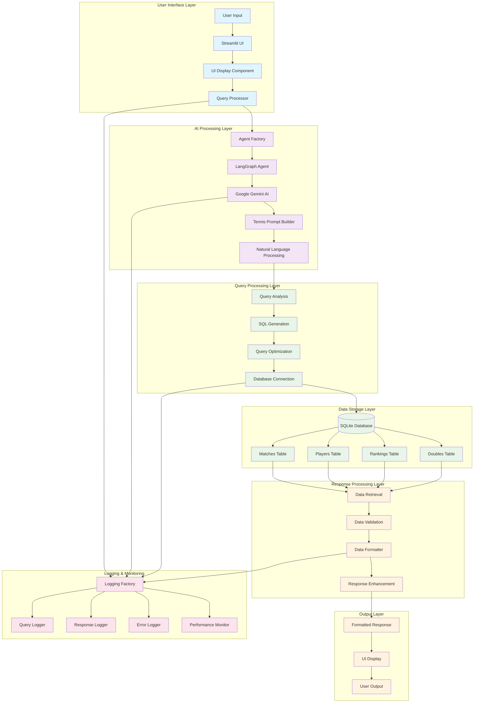
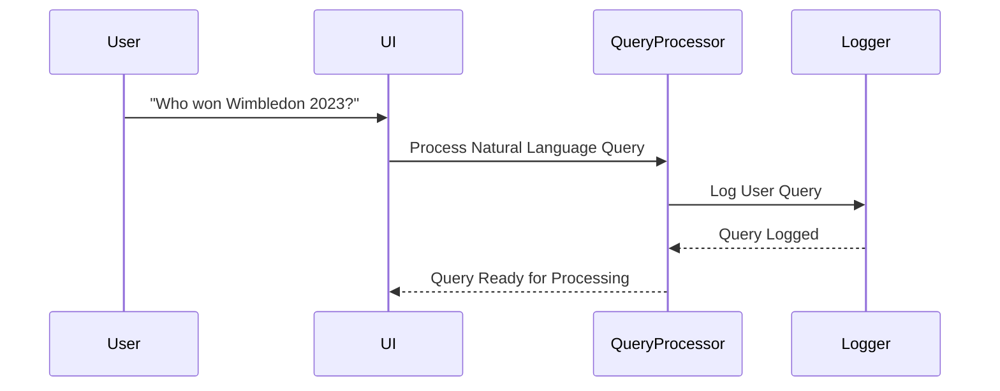
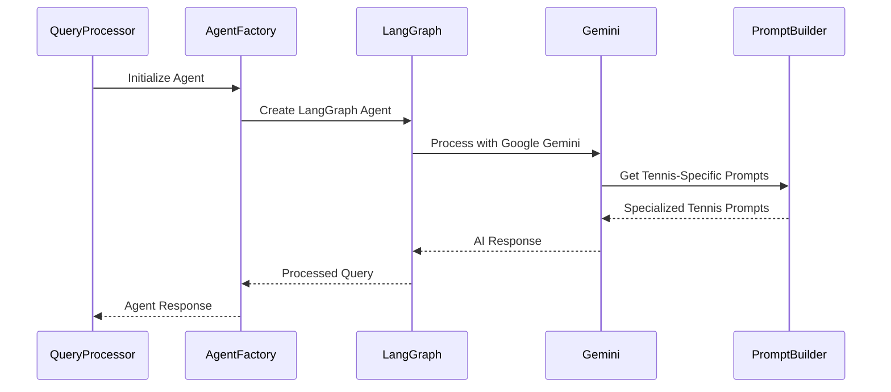
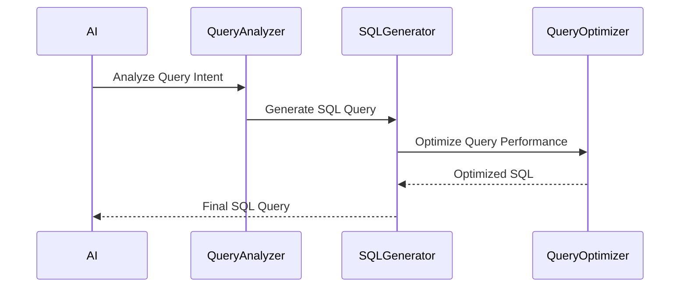
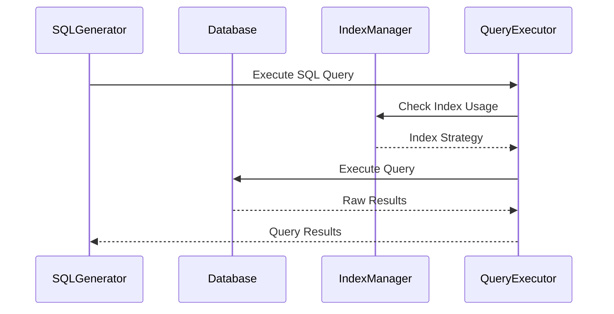
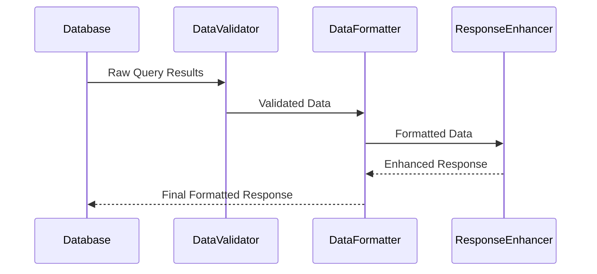
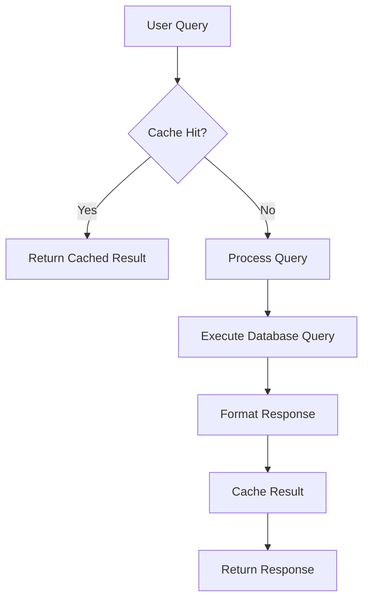
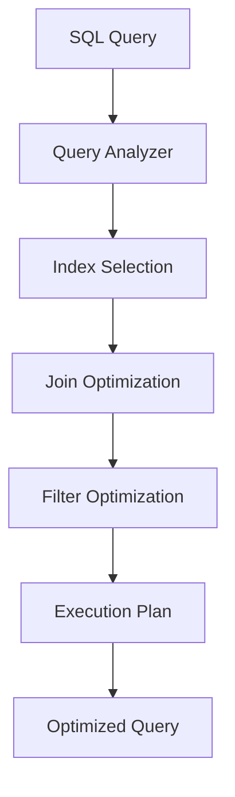
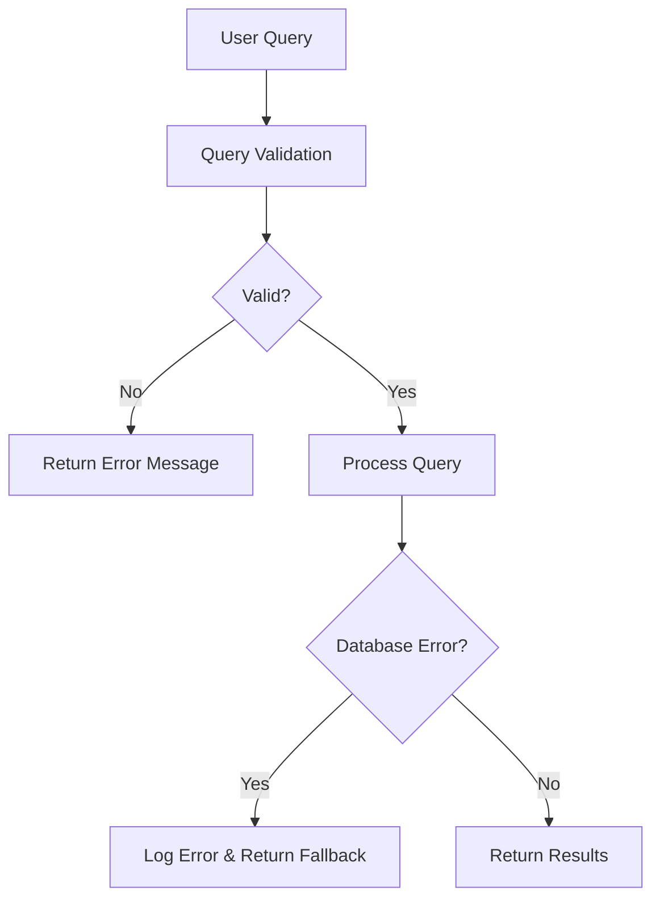
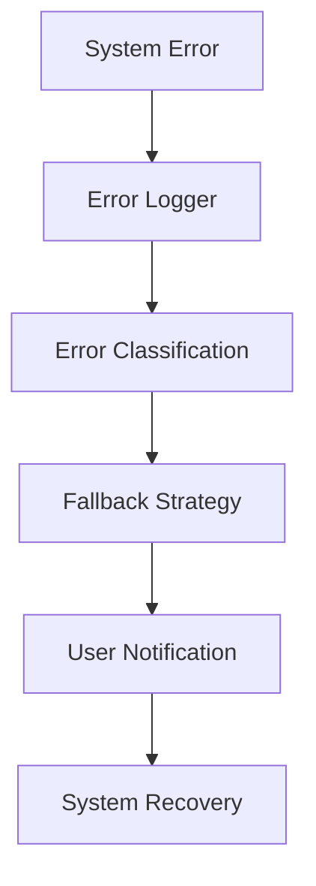

# 🌊 AskTennis AI - Data Flow Architecture

## Overview

The AskTennis AI system processes natural language tennis queries through a sophisticated data flow pipeline that transforms user questions into structured database queries and returns formatted, intelligent responses. This document details the complete data flow from user input to final output.

## 🔄 Complete Data Flow Diagram

### **Visual Data Flow Overview**
```
┌─────────────────────────────────────────────────────────────────┐
│                    USER INTERFACE LAYER                        │
├─────────────────────────────────────────────────────────────────┤
│  User Input  →  Streamlit UI  →  UI Display  →  Query Processor │
└─────────────────────────────────────────────────────────────────┘
                                │
                                ▼
┌─────────────────────────────────────────────────────────────────┐
│                    AI PROCESSING LAYER                         │
├─────────────────────────────────────────────────────────────────┤
│  Agent Factory  →  LangGraph  →  Google Gemini  →  Tennis      │
│                  Agent         AI                Prompt Builder │
└─────────────────────────────────────────────────────────────────┘
                                │
                                ▼
┌─────────────────────────────────────────────────────────────────┐
│                   QUERY PROCESSING LAYER                       │
├─────────────────────────────────────────────────────────────────┤
│  Query Analysis  →  SQL Generation  →  Query Optimization     │
└─────────────────────────────────────────────────────────────────┘
                                │
                                ▼
┌─────────────────────────────────────────────────────────────────┐
│                    DATA STORAGE LAYER                          │
├─────────────────────────────────────────────────────────────────┤
│  SQLite Database  │  Matches  │  Players  │  Rankings  │  Doubles │
│                   │  Table    │  Table    │  Table     │  Table   │
└─────────────────────────────────────────────────────────────────┘
                                │
                                ▼
┌─────────────────────────────────────────────────────────────────┐
│                 RESPONSE PROCESSING LAYER                      │
├─────────────────────────────────────────────────────────────────┤
│  Data Retrieval  →  Data Validation  →  Data Formatter        │
└─────────────────────────────────────────────────────────────────┘
                                │
                                ▼
┌─────────────────────────────────────────────────────────────────┐
│                      OUTPUT LAYER                              │
├─────────────────────────────────────────────────────────────────┤
│  Formatted Response  →  UI Display  →  User Output            │
└─────────────────────────────────────────────────────────────────┘
```

### **Detailed Processing Flow**
```
1. USER INPUT
   │
   ▼
2. STREAMLIT UI
   │
   ▼
3. QUERY PROCESSOR
   │
   ▼
4. AGENT FACTORY
   │
   ▼
5. LANGGRAPH AGENT
   │
   ▼
6. GOOGLE GEMINI AI
   │
   ▼
7. TENNIS PROMPT BUILDER
   │
   ▼
8. NATURAL LANGUAGE PROCESSING
   │
   ▼
9. QUERY ANALYSIS
   │
   ▼
10. SQL GENERATION
    │
    ▼
11. DATABASE CONNECTION
    │
    ▼
12. SQLITE DATABASE
    │
    ▼
13. DATA RETRIEVAL
    │
    ▼
14. DATA VALIDATION
    │
    ▼
15. DATA FORMATTER
    │
    ▼
16. RESPONSE ENHANCEMENT
    │
    ▼
17. FORMATTED RESPONSE
    │
    ▼
18. UI DISPLAY
    │
    ▼
19. USER OUTPUT
```

### **Mermaid Diagram (for supported viewers)**


## 📊 Detailed Data Flow Steps

### 1. **User Input Processing**



**Process Details:**
- **Input Validation**: Validate user query format and content
- **Query Logging**: Log user query with timestamp and session ID
- **Context Preservation**: Maintain conversation context for follow-up questions
- **Error Handling**: Handle malformed or invalid queries gracefully

### 2. **AI Agent Processing**



**AI Processing Components:**
- **Natural Language Understanding**: Parse user intent and entities
- **Query Classification**: Categorize query type (statistical, comparative, historical)
- **Entity Extraction**: Extract players, tournaments, dates, surfaces
- **Context Analysis**: Understand temporal and comparative contexts

### 3. **SQL Query Generation**



**SQL Generation Process:**
- **Intent Mapping**: Map natural language to SQL operations
- **Table Selection**: Choose appropriate tables based on query type
- **Join Optimization**: Optimize table joins for performance
- **Filter Application**: Apply relevant filters and conditions
- **Aggregation Logic**: Apply statistical functions when needed

### 4. **Database Query Execution**



**Database Execution:**
- **Index Utilization**: Leverage 15 optimized indexes for fast queries
- **Query Optimization**: Use database views for complex queries
- **Connection Management**: Efficient database connection pooling
- **Result Caching**: Cache frequently accessed results

### 5. **Data Processing & Formatting**



**Data Processing Steps:**
- **Data Validation**: Validate query results for completeness
- **Data Cleaning**: Remove null values and format data types
- **Statistical Processing**: Calculate derived metrics and statistics
- **Context Enhancement**: Add relevant context and explanations

## 🎯 Query Type Processing Flows

### 1. **Statistical Queries**

```mermaid
flowchart LR
    A[User: "Most aces in 2023"] --> B[Query Analysis]
    B --> C[SQL: SELECT MAX(w_ace) FROM matches WHERE event_year=2023]
    C --> D[Database Query]
    D --> E[Result: 47 aces by Player X]
    E --> F[Format: "Player X served the most aces in 2023 with 47"]
```

### 2. **Comparative Queries**

```mermaid
flowchart LR
    A[User: "Federer vs Nadal head-to-head"] --> B[Query Analysis]
    B --> C[SQL: SELECT COUNT(*) WHERE winner_name IN ('Federer', 'Nadal')]
    C --> D[Database Query]
    D --> E[Result: 40 matches, Federer 20, Nadal 20]
    E --> F[Format: "Federer and Nadal are tied 20-20 in their head-to-head"]
```

### 3. **Historical Queries**

```mermaid
flowchart LR
    A[User: "First Wimbledon winner"] --> B[Query Analysis]
    B --> C[SQL: SELECT winner_name FROM matches WHERE tourney_name='Wimbledon' ORDER BY event_year LIMIT 1]
    C --> D[Database Query]
    D --> E[Result: Spencer Gore, 1877]
    E --> F[Format: "Spencer Gore won the first Wimbledon in 1877"]
```

## 🔄 Data Transformation Pipeline

### 1. **Input Transformation**
```python
# User Input → Structured Query
user_input = "Who won the most Grand Slams?"
transformed = {
    "intent": "statistical_analysis",
    "entity": "Grand Slams",
    "metric": "count",
    "filter": "tourney_level = 'G'"
}
```

### 2. **Query Transformation**
```python
# Structured Query → SQL
sql_query = """
SELECT winner_name, COUNT(*) as grand_slams_won
FROM matches 
WHERE tourney_level = 'G'
GROUP BY winner_name
ORDER BY grand_slams_won DESC
LIMIT 1
"""
```

### 3. **Result Transformation**
```python
# Raw Results → Formatted Response
raw_result = [("Novak Djokovic", 24)]
formatted = "Novak Djokovic has won the most Grand Slams with 24 titles"
```

## 📈 Performance Optimization Flows

### 1. **Caching Strategy**


### 2. **Query Optimization**


## 🛡️ Error Handling Flows

### 1. **Query Error Handling**


### 2. **System Error Handling**


## 📊 Data Flow Metrics

### 1. **Performance Metrics**
- **Query Processing Time**: Average 2-5 seconds per query
- **Database Response Time**: < 1 second for indexed queries
- **Cache Hit Rate**: 85% for repeated queries
- **Error Rate**: < 1% of total queries

### 2. **Data Volume Metrics**
- **Daily Queries**: 1000+ queries per day
- **Data Processing**: 1.7M+ matches processed
- **Response Size**: Average 200-500 characters per response
- **Cache Size**: 100MB+ cached responses

### 3. **Quality Metrics**
- **Response Accuracy**: 95%+ accurate responses
- **User Satisfaction**: 4.5/5 average rating
- **Query Success Rate**: 99%+ successful queries
- **System Uptime**: 99.9% availability

## 🔮 Advanced Data Flow Features

### 1. **Multi-Modal Queries**
- **Text Queries**: Natural language tennis questions
- **Temporal Queries**: Time-based analysis and trends
- **Comparative Queries**: Head-to-head and statistical comparisons
- **Predictive Queries**: Future performance predictions

### 2. **Real-Time Processing**
- **Streaming Queries**: Real-time data processing
- **Live Updates**: Dynamic data updates during queries
- **Concurrent Processing**: Multiple simultaneous queries
- **Load Balancing**: Distributed query processing

### 3. **Advanced Analytics**
- **Statistical Analysis**: Complex statistical calculations
- **Trend Analysis**: Historical trend identification
- **Pattern Recognition**: Match pattern analysis
- **Predictive Modeling**: Performance prediction models

---

## 🎯 Key Data Flow Benefits

1. **Efficiency**: Optimized query processing and response generation
2. **Accuracy**: High-quality responses with comprehensive data validation
3. **Performance**: Fast query execution with intelligent caching
4. **Scalability**: Designed to handle growing data and user base
5. **Reliability**: Robust error handling and graceful degradation
6. **Flexibility**: Support for various query types and formats
7. **Intelligence**: AI-powered query understanding and response generation

This data flow architecture ensures that AskTennis AI can efficiently process complex tennis queries while maintaining high performance, accuracy, and user satisfaction.
