# 🔄 AskTennis AI - Software Process Model

## Overview

The AskTennis AI system follows a modern, iterative software development process that emphasizes modularity, testability, and continuous improvement. The development process is designed to support rapid iteration, quality assurance, and scalable growth while maintaining high code quality and system reliability.

## 🏗️ Software Development Lifecycle

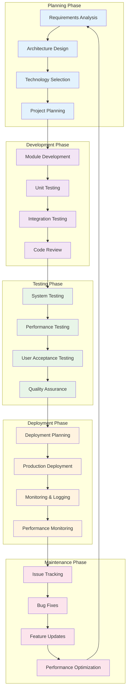

## 🎯 Development Methodology

### 1. **Agile Development Process**

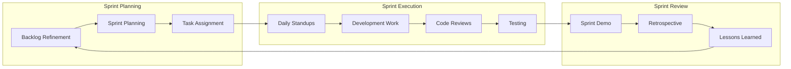

**Sprint Characteristics:**
- **Duration**: 2-week sprints
- **Team Size**: 3-5 developers
- **Daily Standups**: 15-minute daily meetings
- **Sprint Reviews**: End-of-sprint demonstrations
- **Retrospectives**: Continuous improvement sessions

### 2. **Modular Development Approach**

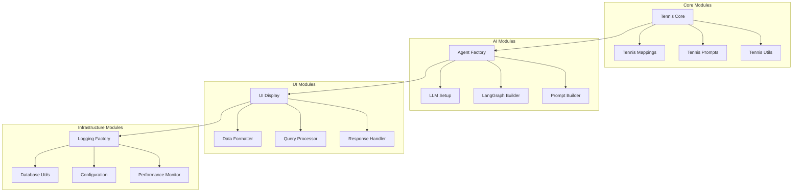

## 🔄 Development Workflow

### 1. **Feature Development Process**

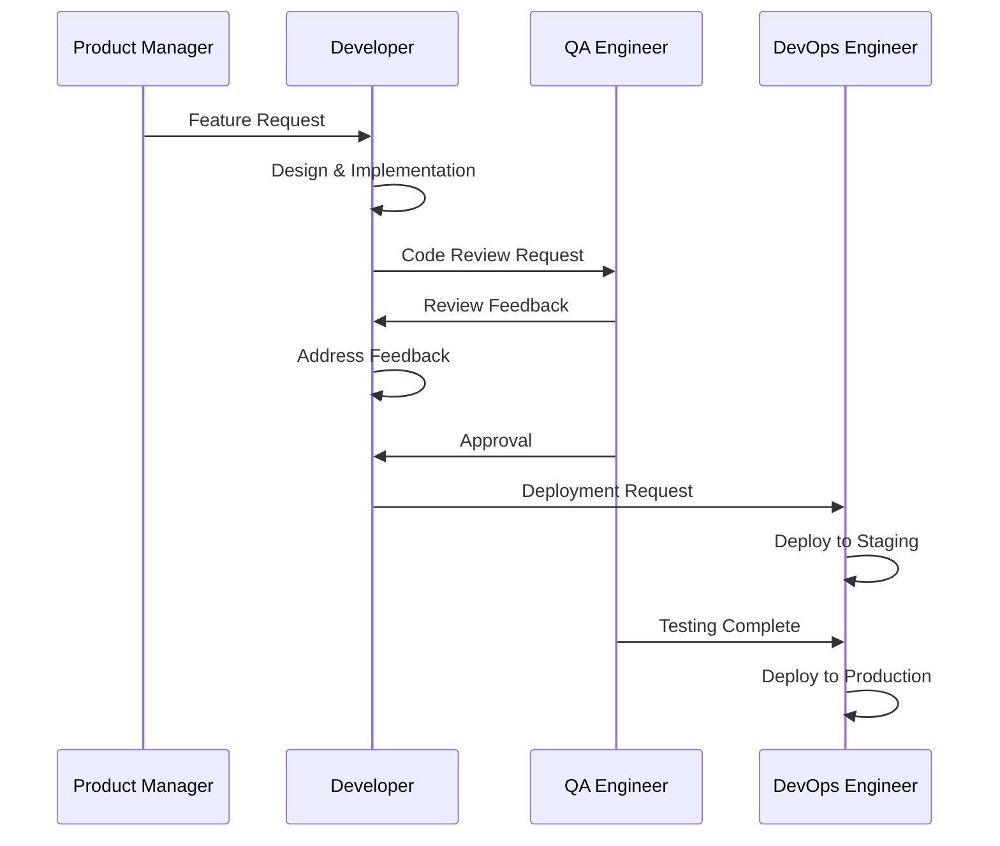

### 2. **Code Quality Process**

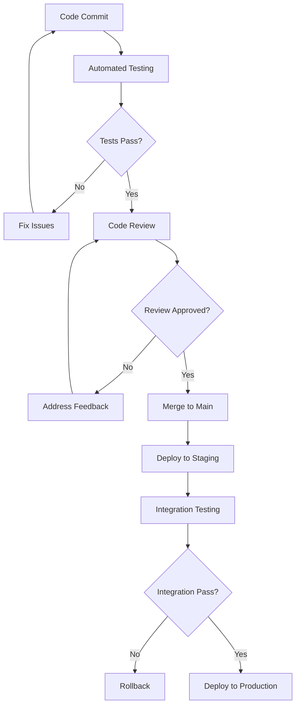

## 🧪 Testing Strategy

### 1. **Testing Pyramid**

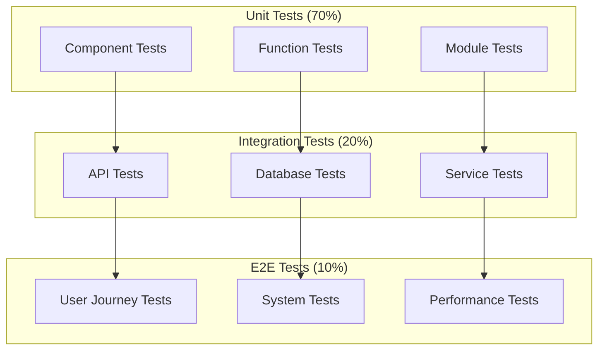

### 2. **Test Automation Framework**

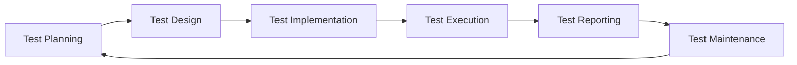

**Testing Components:**
- **Unit Tests**: Individual component testing
- **Integration Tests**: Component interaction testing
- **Performance Tests**: Load and stress testing
- **Security Tests**: Vulnerability and penetration testing
- **User Acceptance Tests**: End-user scenario testing

## 🚀 Deployment Process

### 1. **CI/CD Pipeline**

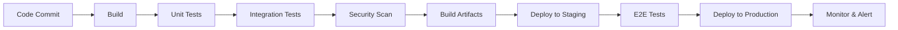

### 2. **Deployment Strategy**

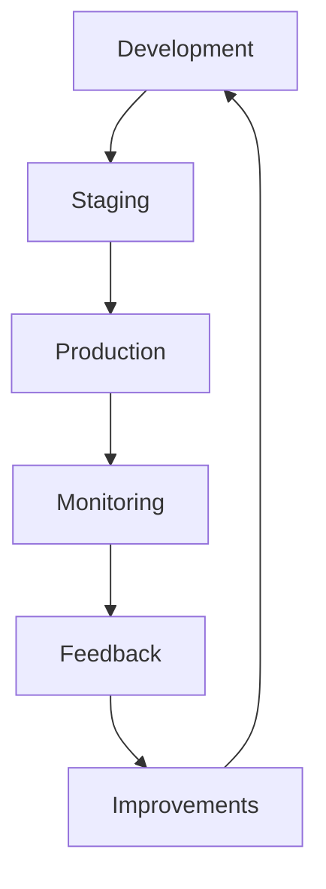

**Deployment Environments:**
- **Development**: Local development environment
- **Staging**: Pre-production testing environment
- **Production**: Live production environment
- **Monitoring**: Real-time system monitoring

## 📊 Quality Assurance Process

### 1. **Code Quality Metrics**

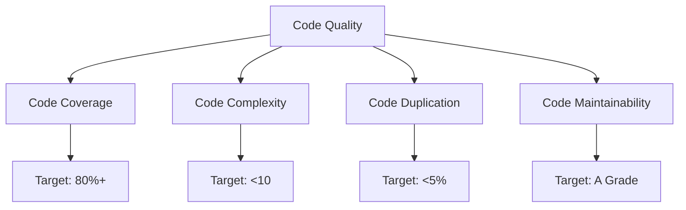

### 2. **Quality Gates**

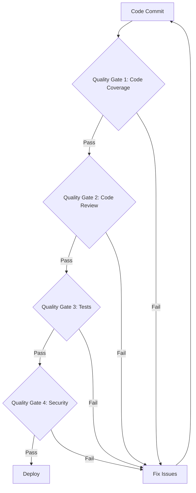

## 🔧 Development Tools & Technologies

### 1. **Development Stack**

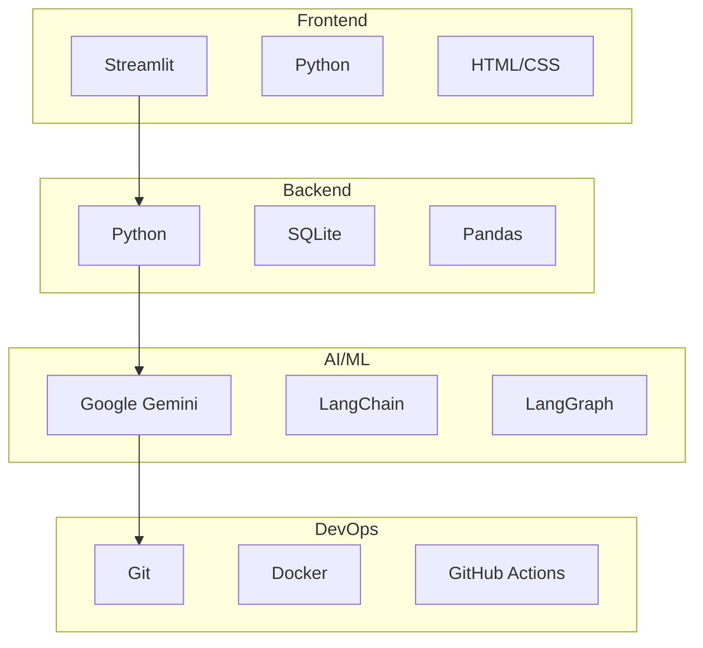

### 2. **Development Environment**

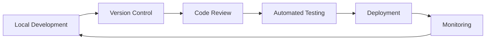

## 📈 Performance Monitoring

### 1. **Performance Metrics**

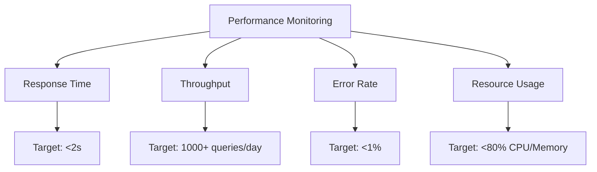

### 2. **Monitoring Dashboard**

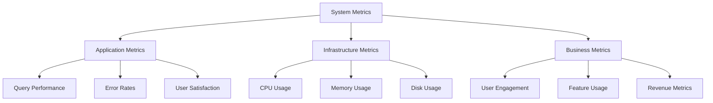

## 🔄 Continuous Improvement

### 1. **Feedback Loop**

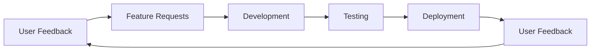

### 2. **Improvement Process**

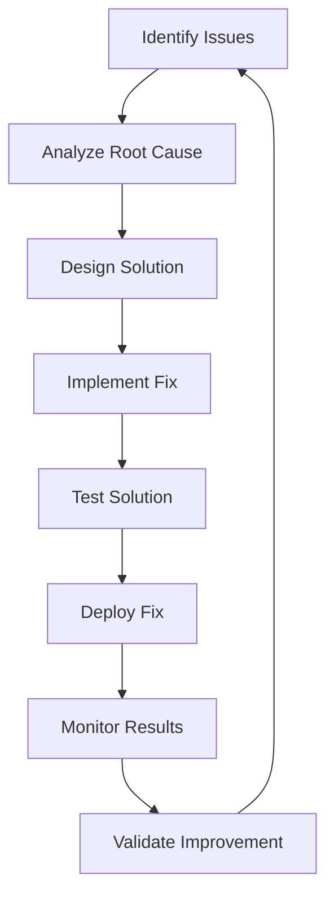

## 🛡️ Risk Management

### 1. **Risk Assessment**

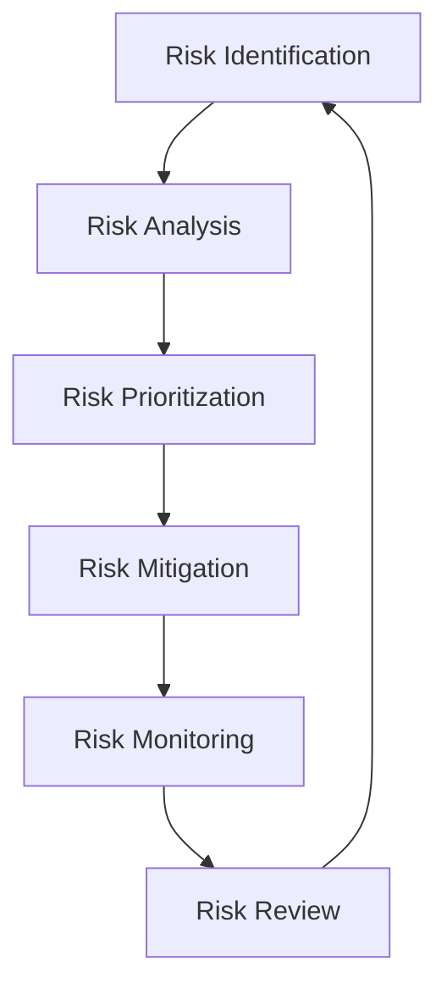

### 2. **Risk Categories**

- **Technical Risks**: Technology failures, performance issues
- **Business Risks**: User adoption, market changes
- **Operational Risks**: System downtime, data loss
- **Security Risks**: Data breaches, unauthorized access

## 📋 Process Documentation

### 1. **Development Standards**

- **Coding Standards**: PEP 8 Python style guide
- **Documentation Standards**: Comprehensive inline documentation
- **Testing Standards**: Minimum 80% code coverage
- **Review Standards**: Mandatory code reviews for all changes

### 2. **Process Metrics**

- **Velocity**: Story points completed per sprint
- **Quality**: Defect density and resolution time
- **Efficiency**: Lead time and cycle time
- **Satisfaction**: Team and user satisfaction scores

---

## 🎯 Key Process Benefits

1. **Quality**: Comprehensive testing and quality assurance
2. **Efficiency**: Streamlined development and deployment processes
3. **Reliability**: Robust error handling and monitoring
4. **Scalability**: Processes designed for growth and expansion
5. **Collaboration**: Clear communication and coordination
6. **Innovation**: Continuous improvement and learning
7. **Risk Management**: Proactive risk identification and mitigation

This software process model ensures that AskTennis AI maintains high quality, reliability, and performance while supporting continuous improvement and innovation.
