# 👥 AskTennis AI - Use Case Diagram & Analysis

## Overview

The AskTennis AI system serves various user types with different needs and capabilities. This document outlines the use cases, actors, and interactions within the tennis analytics platform, providing a comprehensive view of system functionality from a user perspective.

## 🎭 Actors & Roles

### 1. **Primary Actors**
- **Tennis Enthusiast**: Casual tennis fans seeking information
- **Tennis Analyst**: Professional analysts requiring detailed statistics
- **Tennis Researcher**: Academic researchers studying tennis data
- **Tennis Journalist**: Media professionals writing about tennis
- **Tennis Coach**: Coaches analyzing player performance
- **Tennis Player**: Professional or amateur players analyzing their game

### 2. **Secondary Actors**
- **System Administrator**: Manages system configuration and maintenance
- **Data Administrator**: Manages tennis data and updates
- **AI System**: The AI agent that processes queries and generates responses

## 📊 Use Case Diagram
### **Visual Use Case Overview**
```
┌─────────────────────────────────────────────────────────────────┐
│                        ACTORS                                  │
├─────────────────────────────────────────────────────────────────┤
│  Tennis Enthusiast  │  Tennis Analyst  │  Tennis Researcher    │
│  Tennis Journalist  │  Tennis Coach    │  Tennis Player       │
│  System Admin       │  Data Admin      │  AI System           │
└─────────────────────────────────────────────────────────────────┘
                                │
                                ▼
┌─────────────────────────────────────────────────────────────────┐
│                      USE CASES                                 │
├─────────────────────────────────────────────────────────────────┤
│  Ask Questions     │  Statistical Analysis │  Research         │
│  Get Player Info    │  Generate Reports     │  Historical Data  │
│  View Results       │  Analyze Trends       │  Academic Study   │
│  Compare Players    │  Export Data          │  Performance      │
└─────────────────────────────────────────────────────────────────┘
```

### **User Interaction Flow**
```
Tennis Enthusiast ──┐
                    ├── Ask Basic Questions ──┐
Tennis Analyst ─────┤                        ├── AI System ──┐
                    ├── Statistical Analysis ──┤              │
Tennis Researcher ──┤                        │              │
                    ├── Research Queries ──────┤              │
Tennis Journalist ──┤                        │              │
                    ├── Fact Checking ────────┤              │
Tennis Coach ───────┤                        │              │
                    ├── Performance Analysis ──┤              │
Tennis Player ──────┤                        │              │
                    └── Personal Analysis ────┘              │
                                                             │
                                                             ▼
                    ┌─────────────────────────────────────────┐
                    │              RESPONSES                  │
                    ├─────────────────────────────────────────┤
                    │  Formatted Data  │  Charts & Graphs    │
                    │  Text Summary    │  Export Options     │
                    └─────────────────────────────────────────┘
```




```mermaid
graph TB
    subgraph "Tennis Enthusiast"
        UE1[Ask Basic Questions]
        UE2[Get Player Information]
        UE3[View Tournament Results]
        UE4[Compare Players]
    end
    
    subgraph "Tennis Analyst"
        UA1[Perform Statistical Analysis]
        UA2[Generate Reports]
        UA3[Analyze Trends]
        UA4[Compare Eras]
        UA5[Export Data]
    end
    
    subgraph "Tennis Researcher"
        UR1[Conduct Research]
        UR2[Analyze Historical Data]
        UR3[Study Player Development]
        UR4[Research Surface Effects]
        UR5[Academic Analysis]
    end
    
    subgraph "Tennis Journalist"
        UJ1[Write Articles]
        UJ2[Fact-Check Information]
        UJ3[Get Player Statistics]
        UJ4[Analyze Matches]
        UJ5[Create Content]
    end
    
    subgraph "Tennis Coach"
        UC1[Analyze Player Performance]
        UC2[Study Opponents]
        UC3[Plan Training]
        UC4[Track Progress]
        UC5[Compare Players]
    end
    
    subgraph "Tennis Player"
        UP1[Analyze Own Performance]
        UP2[Study Opponents]
        UP3[Track Rankings]
        UP4[Analyze Matches]
        UP5[Set Goals]
    end
    
    subgraph "System Administrator"
        SA1[Manage System]
        SA2[Monitor Performance]
        SA3[Update Configuration]
        SA4[Handle Issues]
    end
    
    subgraph "Data Administrator"
        DA1[Update Data]
        DA2[Validate Data]
        DA3[Manage Database]
        DA4[Backup Data]
    end
    
    subgraph "AI System"
        AI1[Process Queries]
        AI2[Generate Responses]
        AI3[Learn from Interactions]
        AI4[Optimize Performance]
    end
    
    %% Tennis Enthusiast interactions
    UE1 --> AI1
    UE2 --> AI1
    UE3 --> AI1
    UE4 --> AI1
    
    %% Tennis Analyst interactions
    UA1 --> AI1
    UA2 --> AI1
    UA3 --> AI1
    UA4 --> AI1
    UA5 --> AI1
    
    %% Tennis Researcher interactions
    UR1 --> AI1
    UR2 --> AI1
    UR3 --> AI1
    UR4 --> AI1
    UR5 --> AI1
    
    %% Tennis Journalist interactions
    UJ1 --> AI1
    UJ2 --> AI1
    UJ3 --> AI1
    UJ4 --> AI1
    UJ5 --> AI1
    
    %% Tennis Coach interactions
    UC1 --> AI1
    UC2 --> AI1
    UC3 --> AI1
    UC4 --> AI1
    UC5 --> AI1
    
    %% Tennis Player interactions
    UP1 --> AI1
    UP2 --> AI1
    UP3 --> AI1
    UP4 --> AI1
    UP5 --> AI1
    
    %% System interactions
    AI1 --> AI2
    AI2 --> AI3
    AI3 --> AI4
    
    %% Administrator interactions
    SA1 --> SA2
    SA2 --> SA3
    SA3 --> SA4
    
    DA1 --> DA2
    DA2 --> DA3
    DA3 --> DA4
```

## 🎯 Detailed Use Cases

### 1. **Tennis Enthusiast Use Cases**

#### **UC-001: Ask Basic Questions**
- **Actor**: Tennis Enthusiast
- **Description**: Ask simple questions about tennis matches, players, or tournaments
- **Preconditions**: User has access to the system
- **Main Flow**:
  1. User opens the application
  2. User types a question in natural language
  3. System processes the question
  4. System returns a formatted answer
  5. User views the response
- **Postconditions**: User receives accurate information
- **Alternative Flows**: If question is unclear, system asks for clarification

#### **UC-002: Get Player Information**
- **Actor**: Tennis Enthusiast
- **Description**: Retrieve information about specific tennis players
- **Preconditions**: User knows player name
- **Main Flow**:
  1. User asks about a specific player
  2. System searches player database
  3. System returns player information
  4. User views player details
- **Postconditions**: User receives comprehensive player information

#### **UC-003: View Tournament Results**
- **Actor**: Tennis Enthusiast
- **Description**: View results from specific tournaments
- **Preconditions**: User specifies tournament and year
- **Main Flow**:
  1. User asks about tournament results
  2. System queries tournament data
  3. System returns tournament results
  4. User views tournament information
- **Postconditions**: User receives tournament results

### 2. **Tennis Analyst Use Cases**

#### **UC-004: Perform Statistical Analysis**
- **Actor**: Tennis Analyst
- **Description**: Conduct complex statistical analysis of tennis data
- **Preconditions**: User has analytical requirements
- **Main Flow**:
  1. User requests statistical analysis
  2. System processes complex query
  3. System performs calculations
  4. System returns statistical results
  5. User analyzes results
- **Postconditions**: User receives statistical analysis

#### **UC-005: Generate Reports**
- **Actor**: Tennis Analyst
- **Description**: Generate comprehensive reports on tennis data
- **Preconditions**: User specifies report requirements
- **Main Flow**:
  1. User requests report generation
  2. System compiles data
  3. System formats report
  4. System returns formatted report
  5. User views report
- **Postconditions**: User receives formatted report

#### **UC-006: Analyze Trends**
- **Actor**: Tennis Analyst
- **Description**: Analyze trends in tennis data over time
- **Preconditions**: User specifies time period and metrics
- **Main Flow**:
  1. User requests trend analysis
  2. System queries historical data
  3. System calculates trends
  4. System returns trend analysis
  5. User views trends
- **Postconditions**: User receives trend analysis

### 3. **Tennis Researcher Use Cases**

#### **UC-007: Conduct Research**
- **Actor**: Tennis Researcher
- **Description**: Conduct academic research using tennis data
- **Preconditions**: User has research objectives
- **Main Flow**:
  1. User formulates research question
  2. System processes research query
  3. System returns research data
  4. User analyzes data
  5. User draws conclusions
- **Postconditions**: User receives research data

#### **UC-008: Analyze Historical Data**
- **Actor**: Tennis Researcher
- **Description**: Analyze historical tennis data for research
- **Preconditions**: User specifies historical period
- **Main Flow**:
  1. User requests historical analysis
  2. System queries historical database
  3. System returns historical data
  4. User analyzes historical trends
- **Postconditions**: User receives historical analysis

### 4. **Tennis Journalist Use Cases**

#### **UC-009: Write Articles**
- **Actor**: Tennis Journalist
- **Description**: Use system to gather information for articles
- **Preconditions**: User has article topic
- **Main Flow**:
  1. User asks for article information
  2. System provides relevant data
  3. User writes article
  4. User fact-checks information
- **Postconditions**: User has accurate information for article

#### **UC-010: Fact-Check Information**
- **Actor**: Tennis Journalist
- **Description**: Verify facts and statistics for articles
- **Preconditions**: User has information to verify
- **Main Flow**:
  1. User requests fact verification
  2. System searches database
  3. System returns verification data
  4. User confirms accuracy
- **Postconditions**: User has verified information

### 5. **Tennis Coach Use Cases**

#### **UC-011: Analyze Player Performance**
- **Actor**: Tennis Coach
- **Description**: Analyze specific player performance metrics
- **Preconditions**: User specifies player and metrics
- **Main Flow**:
  1. User requests player analysis
  2. System queries player data
  3. System returns performance metrics
  4. User analyzes performance
- **Postconditions**: User receives player performance analysis

#### **UC-012: Study Opponents**
- **Actor**: Tennis Coach
- **Description**: Study opponent players for match preparation
- **Preconditions**: User specifies opponent
- **Main Flow**:
  1. User requests opponent analysis
  2. System queries opponent data
  3. System returns opponent statistics
  4. User studies opponent
- **Postconditions**: User receives opponent analysis

### 6. **Tennis Player Use Cases**

#### **UC-013: Analyze Own Performance**
- **Actor**: Tennis Player
- **Description**: Analyze personal performance and statistics
- **Preconditions**: User specifies personal data
- **Main Flow**:
  1. User requests personal analysis
  2. System queries personal data
  3. System returns performance metrics
  4. User analyzes personal performance
- **Postconditions**: User receives personal performance analysis

#### **UC-014: Track Rankings**
- **Actor**: Tennis Player
- **Description**: Track personal ranking and progress
- **Preconditions**: User has ranking data
- **Main Flow**:
  1. User requests ranking information
  2. System queries ranking data
  3. System returns ranking history
  4. User tracks progress
- **Postconditions**: User receives ranking information

## 🔄 Use Case Relationships

### 1. **Include Relationships**
- **UC-001** includes **UC-002** (Basic questions often include player information)
- **UC-004** includes **UC-005** (Statistical analysis often leads to report generation)
- **UC-007** includes **UC-008** (Research often includes historical analysis)

### 2. **Extend Relationships**
- **UC-003** extends **UC-001** (Tournament results extend basic questions)
- **UC-006** extends **UC-004** (Trend analysis extends statistical analysis)
- **UC-010** extends **UC-009** (Fact-checking extends article writing)

### 3. **Generalization Relationships**
- **UC-001** generalizes **UC-002**, **UC-003** (Basic questions generalize to specific information)
- **UC-004** generalizes **UC-005**, **UC-006** (Statistical analysis generalizes to reports and trends)

## 📊 Use Case Priorities

### 1. **High Priority Use Cases**
- **UC-001**: Ask Basic Questions (Core functionality)
- **UC-002**: Get Player Information (Essential feature)
- **UC-003**: View Tournament Results (Core functionality)
- **UC-004**: Perform Statistical Analysis (Advanced feature)

### 2. **Medium Priority Use Cases**
- **UC-005**: Generate Reports (Important for analysts)
- **UC-006**: Analyze Trends (Valuable for research)
- **UC-007**: Conduct Research (Academic value)
- **UC-009**: Write Articles (Media value)

### 3. **Low Priority Use Cases**
- **UC-011**: Analyze Player Performance (Specialized use)
- **UC-013**: Analyze Own Performance (Personal use)
- **UC-014**: Track Rankings (Personal tracking)

## 🎯 Use Case Scenarios

### 1. **Scenario 1: Casual Tennis Fan**
```
Actor: Tennis Enthusiast
Goal: Learn about Roger Federer's career
Steps:
1. Ask "Who is Roger Federer?"
2. Get basic player information
3. Ask "How many Grand Slams did he win?"
4. Get statistical information
5. Ask "When did he retire?"
6. Get career timeline information
```

### 2. **Scenario 2: Tennis Analyst**
```
Actor: Tennis Analyst
Goal: Analyze player performance trends
Steps:
1. Request "Show me Novak Djokovic's performance by surface"
2. Get surface-specific statistics
3. Request "Compare his performance across different years"
4. Get temporal analysis
5. Request "Generate a report on his career trajectory"
6. Get comprehensive report
```

### 3. **Scenario 3: Tennis Researcher**
```
Actor: Tennis Researcher
Goal: Study the impact of court surface on match outcomes
Steps:
1. Request "Show me match outcomes by surface type"
2. Get surface-specific match data
3. Request "Analyze the correlation between surface and match duration"
4. Get statistical correlation analysis
5. Request "Compare amateur vs professional era surface preferences"
6. Get historical analysis
```

## 🛡️ Use Case Constraints

### 1. **Functional Constraints**
- **Query Complexity**: System handles queries of varying complexity
- **Response Time**: Responses delivered within 5 seconds
- **Data Accuracy**: 95%+ accuracy in responses
- **Language Support**: Natural language processing in English

### 2. **Non-Functional Constraints**
- **Performance**: System handles 1000+ concurrent users
- **Availability**: 99.9% uptime requirement
- **Security**: User data protection and privacy
- **Scalability**: System scales with growing user base

### 3. **Business Constraints**
- **Cost**: System operates within budget constraints
- **Compliance**: Meets data protection regulations
- **Integration**: Integrates with existing systems
- **Maintenance**: Minimal maintenance requirements

---

## 🎯 Key Use Case Benefits

1. **User-Centric Design**: Use cases designed around user needs and goals
2. **Comprehensive Coverage**: Covers all major user types and scenarios
3. **Flexible Interaction**: Supports various interaction patterns and complexity levels
4. **Scalable Architecture**: Use cases designed for system growth and expansion
5. **Quality Assurance**: Each use case includes quality and performance requirements
6. **User Satisfaction**: Use cases prioritize user experience and satisfaction
7. **Business Value**: Use cases deliver measurable business value and outcomes

This use case analysis ensures that AskTennis AI meets the diverse needs of all user types while maintaining high quality, performance, and user satisfaction.
