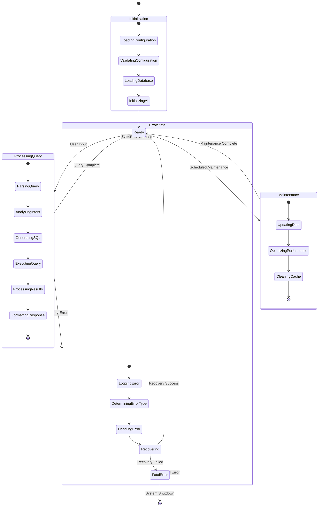
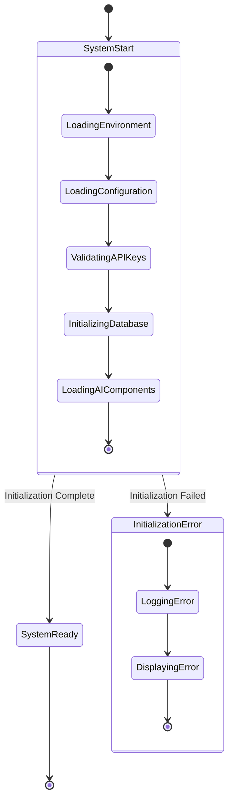
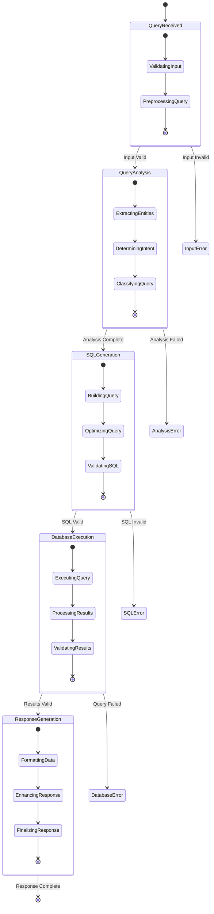
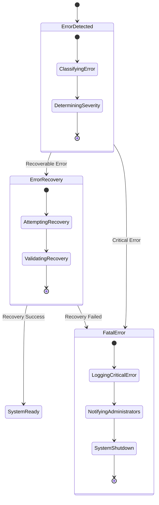
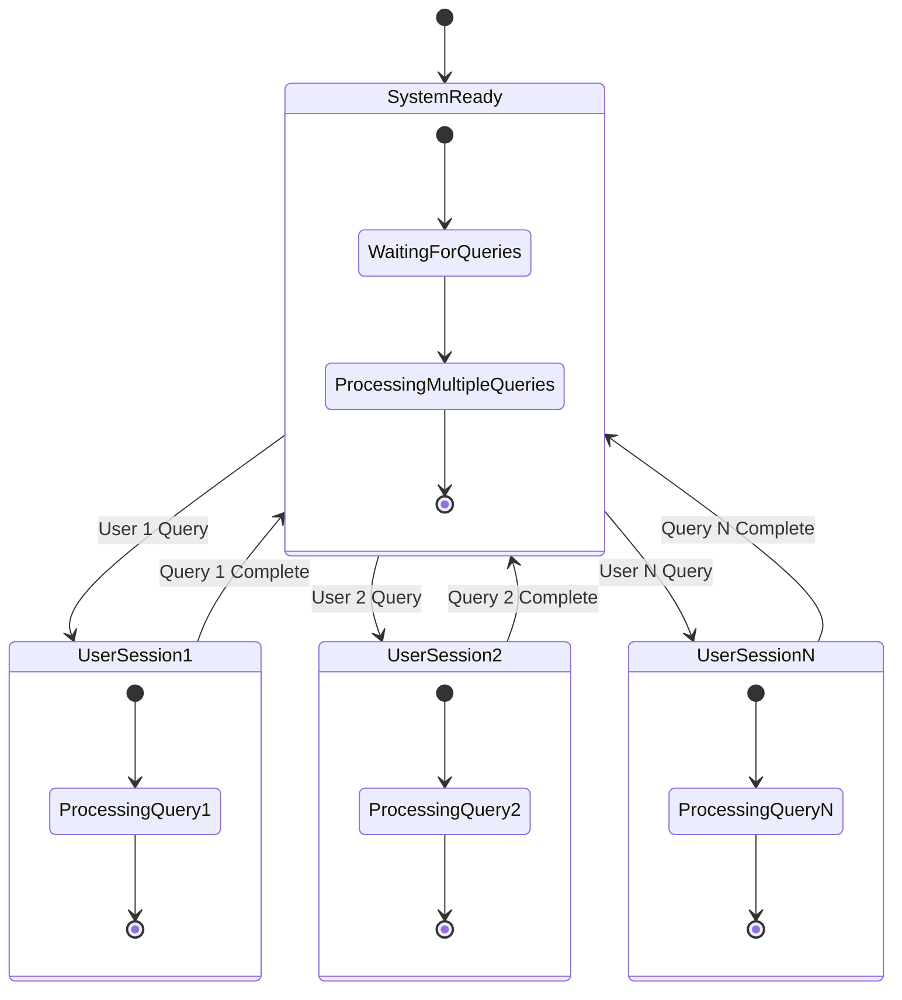
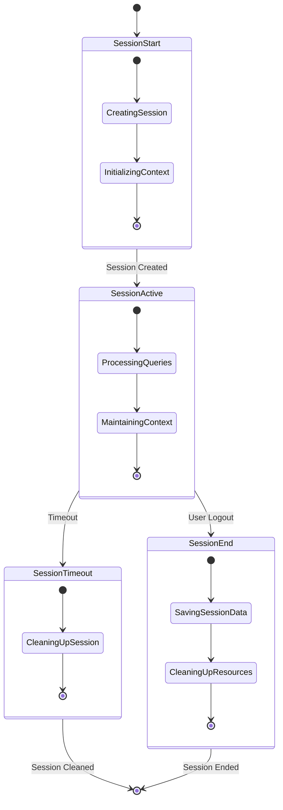
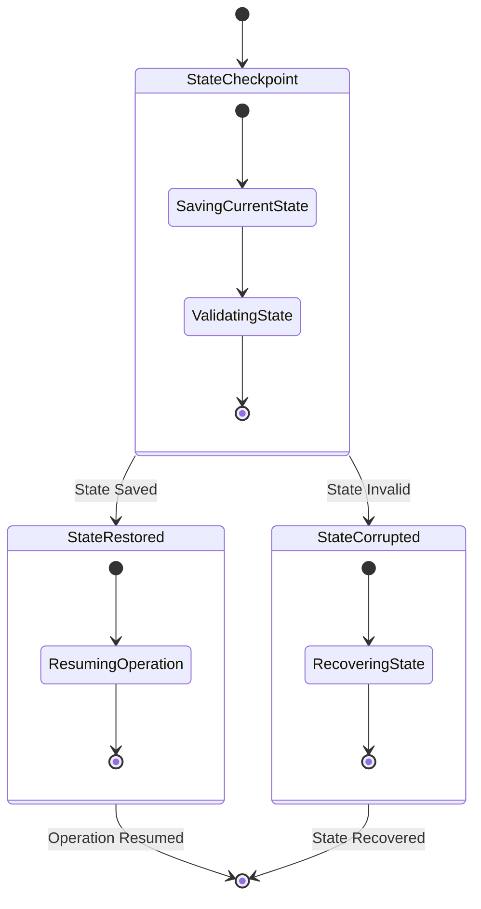
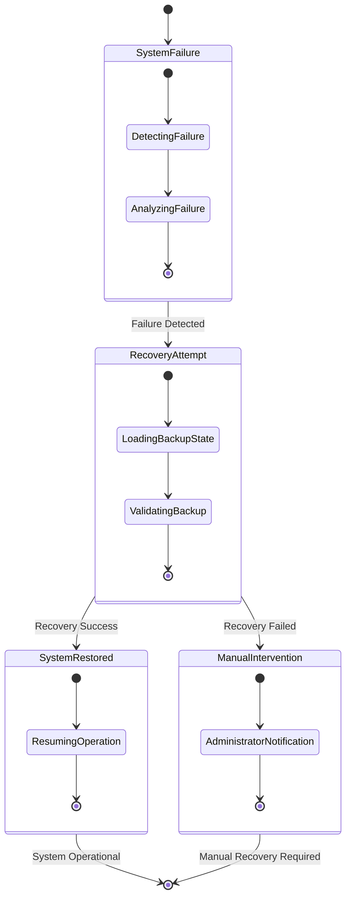
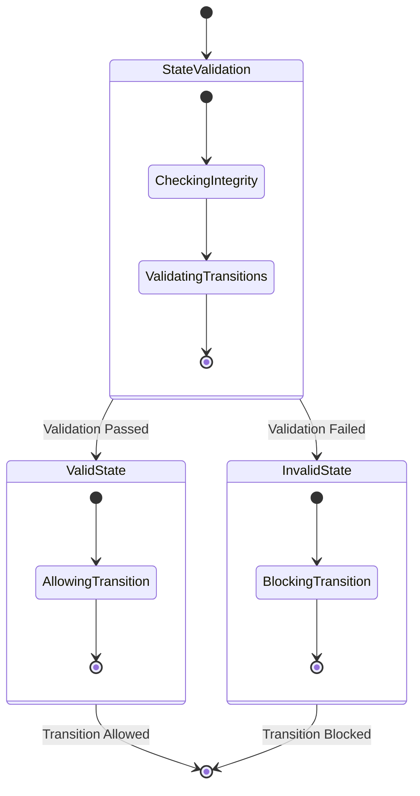
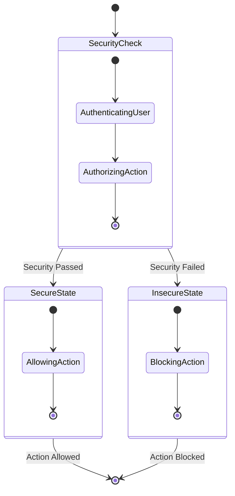

# 🔄 AskTennis AI - State Diagram & Analysis

## Overview

The AskTennis AI system operates through various states during its lifecycle, from initialization to query processing and response generation. This document outlines the state transitions, conditions, and behaviors that govern the system's operation.

## 🎯 System State Diagram
### **Visual State Flow**
```
┌─────────────────────────────────────────────────────────────────┐
│                    SYSTEM STATES                                │
├─────────────────────────────────────────────────────────────────┤
│  [*] ──→ Initialization ──→ Ready ──→ ProcessingQuery ──→ Ready │
│         │                │           │                        │
│         ▼                ▼           ▼                        │
│    ErrorState ──────────┐           │                        │
│         │               │           │                        │
│         ▼               │           ▼                        │
│    FatalError ──────────┘      ErrorState ──────────────────┘
└─────────────────────────────────────────────────────────────────┘
```

### **State Transition Flow**
```
1. [*] (Start)
   │
   ▼
2. Initialization
   │
   ▼
3. Ready
   │
   ▼
4. ProcessingQuery
   │
   ▼
5. Ready (Success)
   │
   ▼
6. ErrorState (if error)
   │
   ▼
7. FatalError (if critical)
   │
   ▼
8. [*] (End)
```




## 🔄 Detailed State Transitions

### 1. **System Initialization States**



**Initialization State Details:**
- **LoadingEnvironment**: Load environment variables and configuration
- **LoadingConfiguration**: Load system configuration and settings
- **ValidatingAPIKeys**: Validate API keys and external service connections
- **InitializingDatabase**: Initialize database connections and verify data integrity
- **LoadingAIComponents**: Load AI models, prompts, and processing components

### 2. **Query Processing States**



### 3. **Error Handling States**



## 🎯 State Transition Conditions

### 1. **Initialization Transitions**

| From State | To State | Condition | Action |
|------------|----------|-----------|---------|
| [*] | LoadingConfiguration | System Start | Load environment variables |
| LoadingConfiguration | ValidatingConfiguration | Config Loaded | Validate configuration settings |
| ValidatingConfiguration | LoadingDatabase | Config Valid | Initialize database connection |
| LoadingDatabase | InitializingAI | DB Connected | Load AI components |
| InitializingAI | Ready | AI Loaded | System ready for queries |

### 2. **Query Processing Transitions**

| From State | To State | Condition | Action |
|------------|----------|-----------|---------|
| Ready | ProcessingQuery | User Input Received | Start query processing |
| ProcessingQuery | ParsingQuery | Query Valid | Parse natural language |
| ParsingQuery | AnalyzingIntent | Parse Success | Analyze user intent |
| AnalyzingIntent | GeneratingSQL | Intent Clear | Generate SQL query |
| GeneratingSQL | ExecutingQuery | SQL Valid | Execute database query |
| ExecutingQuery | ProcessingResults | Query Success | Process query results |
| ProcessingResults | FormattingResponse | Results Valid | Format response |
| FormattingResponse | Ready | Response Complete | Return to ready state |

### 3. **Error Handling Transitions**

| From State | To State | Condition | Action |
|------------|----------|-----------|---------|
| ProcessingQuery | ErrorState | Query Error | Handle query error |
| ErrorState | LoggingError | Error Detected | Log error details |
| LoggingError | DeterminingErrorType | Error Logged | Classify error type |
| DeterminingErrorType | HandlingError | Error Classified | Handle specific error |
| HandlingError | Recovering | Error Handled | Attempt recovery |
| Recovering | Ready | Recovery Success | Return to ready state |
| Recovering | FatalError | Recovery Failed | System shutdown |

## 🔄 Concurrent State Management

### 1. **Multi-User State Handling**



### 2. **Session State Management**



## 🎯 State Persistence & Recovery

### 1. **State Persistence**



### 2. **Recovery Mechanisms**



## 📊 State Monitoring & Metrics

### 1. **State Transition Metrics**

| Metric | Description | Target Value |
|--------|-------------|--------------|
| Initialization Time | Time to reach Ready state | < 30 seconds |
| Query Processing Time | Time in ProcessingQuery state | < 5 seconds |
| Error Recovery Time | Time to recover from errors | < 10 seconds |
| State Persistence Time | Time to save/restore state | < 1 second |

### 2. **State Quality Metrics**

| Metric | Description | Target Value |
|--------|-------------|--------------|
| State Consistency | Percentage of consistent states | 99.9% |
| Error Rate | Percentage of error states | < 1% |
| Recovery Success Rate | Percentage of successful recoveries | 95% |
| State Persistence Success | Percentage of successful state saves | 99.9% |

## 🛡️ State Security & Validation

### 1. **State Validation**



### 2. **State Security**



## 🔮 Advanced State Features

### 1. **State Machine Optimization**

- **State Caching**: Cache frequently accessed states
- **Lazy Loading**: Load states on demand
- **State Compression**: Compress state data for efficiency
- **State Deduplication**: Remove duplicate state information

### 2. **State Analytics**

- **State Usage Patterns**: Analyze state transition patterns
- **Performance Optimization**: Optimize based on state usage
- **Predictive State Management**: Predict future state needs
- **State Lifecycle Management**: Manage state lifecycle efficiently

### 3. **State Integration**

- **External State Sync**: Synchronize with external systems
- **State Replication**: Replicate states across instances
- **State Migration**: Migrate states between versions
- **State Backup**: Backup critical states

---

## 🎯 Key State Management Benefits

1. **Reliability**: Robust state management ensures system reliability
2. **Performance**: Optimized state transitions improve performance
3. **Scalability**: State management scales with system growth
4. **Maintainability**: Clear state management improves maintainability
5. **Debugging**: State tracking aids in debugging and troubleshooting
6. **Recovery**: State persistence enables system recovery
7. **Monitoring**: State monitoring provides system insights

This state diagram analysis ensures that AskTennis AI maintains reliable, efficient, and scalable state management throughout its operation.
