# 🎨 AskTennis AI - UI/UX Design Documentation

## Overview

The AskTennis AI system features a modern, intuitive user interface designed to provide seamless access to comprehensive tennis analytics. The UI/UX design emphasizes user experience, accessibility, and visual appeal while maintaining high functionality and performance.

## 🎯 Design Philosophy

### 1. **User-Centered Design**
- **Intuitive Navigation**: Easy-to-use interface for all user types
- **Accessibility**: Support for users with different abilities
- **Responsive Design**: Optimized for various screen sizes and devices
- **Performance**: Fast loading and responsive interactions

### 2. **Visual Design Principles**
- **Clean Aesthetics**: Minimalist design with clear visual hierarchy
- **Consistent Branding**: Cohesive visual identity throughout the application
- **Color Psychology**: Strategic use of colors to enhance user experience
- **Typography**: Readable and professional typography choices

## 🎯 Application Interface Design

AskTennis AI features two distinct user interfaces designed for different use cases and user needs:

### 🚀 **Basic AI Interface** (`app_basic.py`)
- **Purpose**: Simple AI-powered tennis querying
- **Design Philosophy**: Minimalist, focused on AI interaction
- **Key Features**: 
  - Clean search interface
  - Natural language input
  - AI-powered responses
  - Example questions display
- **Target Users**: Casual tennis fans, quick queries

### 🎨 **Enhanced UI Interface** (`app_ui.py`)
- **Purpose**: Comprehensive tennis data analysis with AI integration
- **Design Philosophy**: Feature-rich, data-focused interface
- **Key Features**:
  - Advanced filtering system
  - Interactive data tables
  - AI query integration
  - Real-time data analysis
  - Database service integration
- **Target Users**: Data analysts, researchers, detailed analysis

## 🎨 UI/UX Design Diagram
### **Visual UI Layout - Basic Interface**
```
┌─────────────────────────────────────────────────────────────────┐
│                        HEADER                                  │
├─────────────────────────────────────────────────────────────────┤
│  Logo & Title  │  Navigation Menu  │  User Profile            │
└─────────────────────────────────────────────────────────────────┘
                                │
                                ▼
┌─────────────────────────────────────────────────────────────────┐
│                    MAIN CONTENT AREA                           │
├─────────────────────────────────────────────────────────────────┤
│  Search Interface  │  Query Input  │  Example Questions       │
│  Results Display   │  AI Response   │  Natural Language        │
└─────────────────────────────────────────────────────────────────┘
```

### **Visual UI Layout - Enhanced Interface**
```
┌─────────────────────────────────────────────────────────────────┐
│                        HEADER                                  │
├─────────────────────────────────────────────────────────────────┤
│  Logo & Title  │  Navigation Menu  │  User Profile            │
└─────────────────────────────────────────────────────────────────┘
                                │
                                ▼
┌─────────────────────────────────────────────────────────────────┐
│                    MAIN CONTENT AREA                           │
├─────────────────────────────────────────────────────────────────┤
│  Search Interface  │  Query Input  │  AI Query Integration    │
│  Results Display   │  Data Tables  │  Charts & Graphs         │
│  Filter Panel      │  Database      │  Export Options          │
│                   │  Service       │                          │
└─────────────────────────────────────────────────────────────────┘
                                │
                                ▼
┌─────────────────────────────────────────────────────────────────┐
│                        SIDEBAR                                 │
├─────────────────────────────────────────────────────────────────┤
│  Quick Stats  │  Recent Queries  │  Help & Tips              │
│  Filter Panel │  Data Analysis   │  Advanced Options         │
└─────────────────────────────────────────────────────────────────┘

### **Component Hierarchy - Basic Interface**
```
Basic UI Application (app_basic.py)
├── Header Component
│   ├── Logo
│   ├── Title
│   └── User Menu
├── Main Content
│   ├── Search Interface
│   ├── Query Input
│   └── Results Display
└── Footer
    ├── System Status
    └── Version Info
```

### **Component Hierarchy - Enhanced Interface**
```
Enhanced UI Application (app_ui.py)
├── Header Component
│   ├── Logo
│   ├── Title
│   └── User Menu
├── Main Content
│   ├── Search Interface
│   ├── Query Input
│   ├── Results Display
│   ├── Data Tables
│   └── Database Service
├── Sidebar
│   ├── Filter Panel
│   ├── Quick Stats
│   ├── Recent Queries
│   └── Help & Tips
└── Footer
    ├── System Status
    ├── Version Info
    └── Contact Info
```


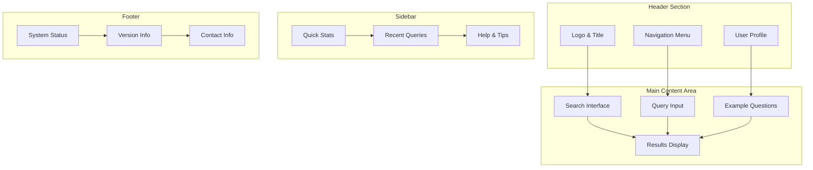
```mermaid
graph TB
    subgraph "Header Section"
        A[Logo & Title]
        B[Navigation Menu]
        C[User Profile]
    end
    
    subgraph "Main Content Area"
        D[Search Interface]
        E[Query Input]
        F[Example Questions]
        G[Results Display]
    end
    
    subgraph "Sidebar"
        H[Quick Stats]
        I[Recent Queries]
        J[Help & Tips]
    end
    
    subgraph "Footer"
        K[System Status]
        L[Version Info]
        M[Contact Info]
    end
    
    A --> D
    B --> E
    C --> F
    D --> G
    E --> G
    F --> G
    H --> I
    I --> J
    K --> L
    L --> M
```

## 🎨 Visual Design System

### 1. **Color Palette**

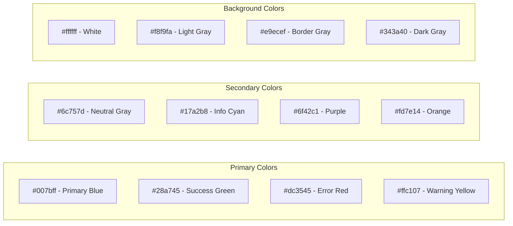
```mermaid
graph LR
    subgraph "Primary Colors"
        A[#007bff - Primary Blue]
        B[#28a745 - Success Green]
        C[#dc3545 - Error Red]
        D[#ffc107 - Warning Yellow]
    end
    
    subgraph "Secondary Colors"
        E[#6c757d - Neutral Gray]
        F[#17a2b8 - Info Cyan]
        G[#6f42c1 - Purple]
        H[#fd7e14 - Orange]
    end
    
    subgraph "Background Colors"
        I[#ffffff - White]
        J[#f8f9fa - Light Gray]
        K[#e9ecef - Border Gray]
        L[#343a40 - Dark Gray]
    end
```

**Color Usage Guidelines:**
- **Primary Blue (#007bff)**: Main actions, links, and highlights
- **Success Green (#28a745)**: Success messages and positive indicators
- **Error Red (#dc3545)**: Error messages and warnings
- **Warning Yellow (#ffc107)**: Caution and attention-grabbing elements
- **Neutral Gray (#6c757d)**: Secondary text and subtle elements

### 2. **Typography System**

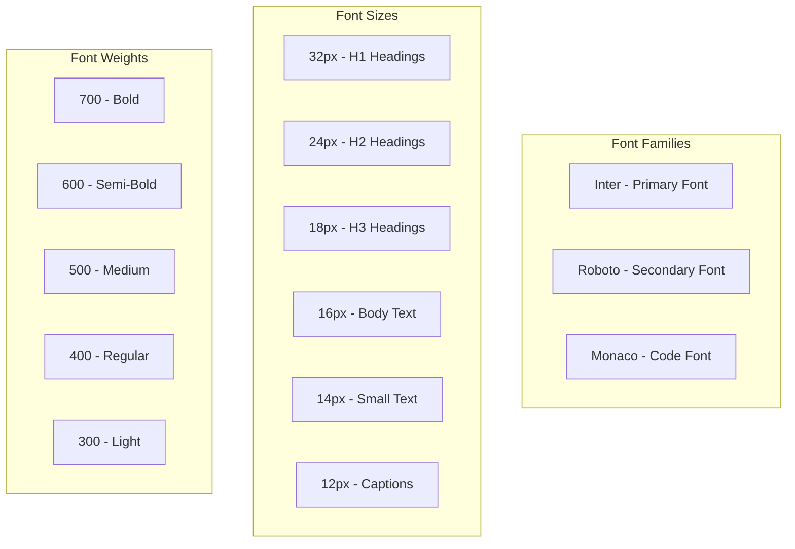
```mermaid
graph TD
    subgraph "Font Families"
        A[Inter - Primary Font]
        B[Roboto - Secondary Font]
        C[Monaco - Code Font]
    end
    
    subgraph "Font Sizes"
        D[32px - H1 Headings]
        E[24px - H2 Headings]
        F[18px - H3 Headings]
        G[16px - Body Text]
        H[14px - Small Text]
        I[12px - Captions]
    end
    
    subgraph "Font Weights"
        J[700 - Bold]
        K[600 - Semi-Bold]
        L[500 - Medium]
        M[400 - Regular]
        N[300 - Light]
    end
```

### 3. **Spacing System**

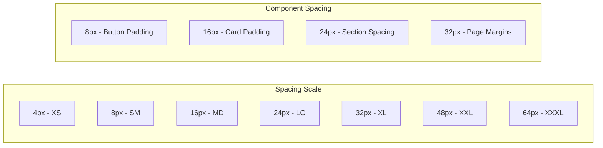
```mermaid
graph LR
    subgraph "Spacing Scale"
        A[4px - XS]
        B[8px - SM]
        C[16px - MD]
        D[24px - LG]
        E[32px - XL]
        F[48px - XXL]
        G[64px - XXXL]
    end
    
    subgraph "Component Spacing"
        H[8px - Button Padding]
        I[16px - Card Padding]
        J[24px - Section Spacing]
        K[32px - Page Margins]
    end
```

## 🎯 Component Design

### 1. **Header Component**

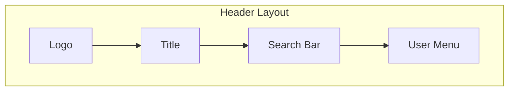
```mermaid
graph TB
    subgraph "Header Layout"
        A[Logo]
        B[Title]
        C[Search Bar]
        D[User Menu]
    end
    
    A --> B
    B --> C
    C --> D
```

**Header Features:**
- **Logo**: AskTennis AI branding
- **Title**: Clear application name
- **Search Bar**: Quick access to search functionality
- **User Menu**: User profile and settings

### 2. **Search Interface**

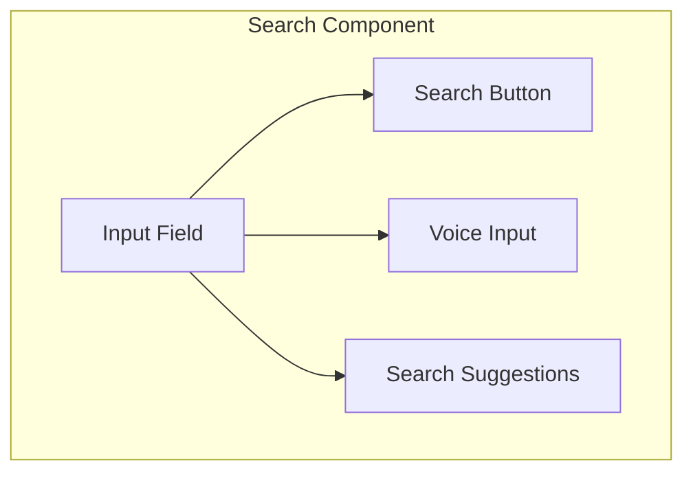
```mermaid
graph TB
    subgraph "Search Component"
        A[Input Field]
        B[Search Button]
        C[Voice Input]
        D[Search Suggestions]
    end
    
    A --> B
    A --> C
    A --> D
```

**Search Features:**
- **Natural Language Input**: Support for conversational queries
- **Auto-complete**: Intelligent suggestions based on previous queries
- **Voice Input**: Speech-to-text functionality
- **Query Examples**: Pre-defined example questions

### 3. **Results Display**

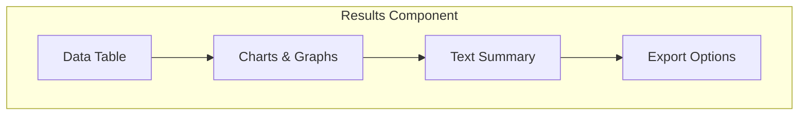
```mermaid
graph TB
    subgraph "Results Component"
        A[Data Table]
        B[Charts & Graphs]
        C[Text Summary]
        D[Export Options]
    end
    
    A --> B
    B --> C
    C --> D
```

**Results Features:**
- **Data Tables**: Structured data presentation
- **Visualizations**: Charts and graphs for data analysis
- **Text Summaries**: Natural language explanations
- **Export Options**: Download data in various formats

## 📱 Responsive Design

### 1. **Breakpoint System**

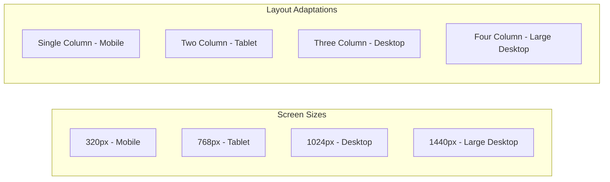
```mermaid
graph LR
    subgraph "Screen Sizes"
        A[320px - Mobile]
        B[768px - Tablet]
        C[1024px - Desktop]
        D[1440px - Large Desktop]
    end
    
    subgraph "Layout Adaptations"
        E[Single Column - Mobile]
        F[Two Column - Tablet]
        G[Three Column - Desktop]
        H[Four Column - Large Desktop]
    end
```

### 2. **Mobile-First Design**

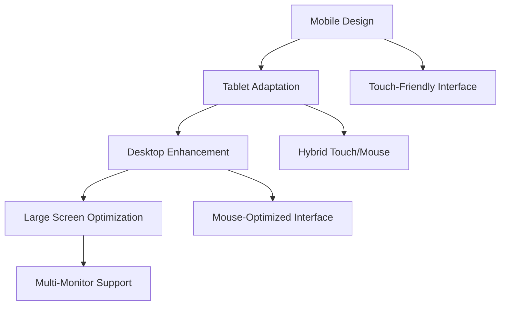
```mermaid
graph TD
    A[Mobile Design] --> B[Tablet Adaptation]
    B --> C[Desktop Enhancement]
    C --> D[Large Screen Optimization]
    
    A --> E[Touch-Friendly Interface]
    B --> F[Hybrid Touch/Mouse]
    C --> G[Mouse-Optimized Interface]
    D --> H[Multi-Monitor Support]
```

## 🎨 User Experience Flows

### 1. **Primary User Journey**

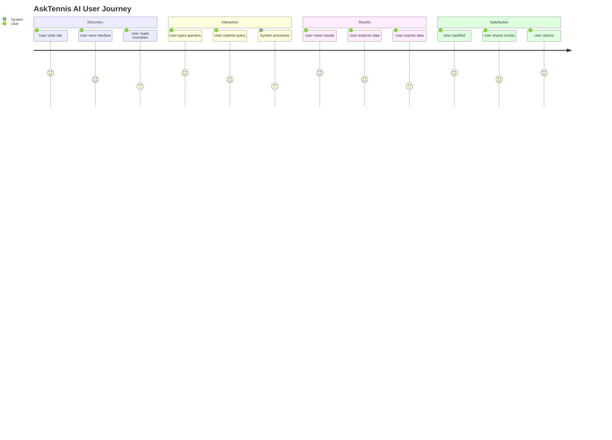
```mermaid
journey
    title AskTennis AI User Journey
    section Discovery
      User visits site: 5: User
      User sees interface: 4: User
      User reads examples: 3: User
    section Interaction
      User types question: 5: User
      User submits query: 4: User
      System processes: 3: System
    section Results
      User views results: 5: User
      User explores data: 4: User
      User exports data: 3: User
    section Satisfaction
      User satisfied: 5: User
      User shares results: 4: User
      User returns: 5: User
```

### 2. **Query Processing Flow**

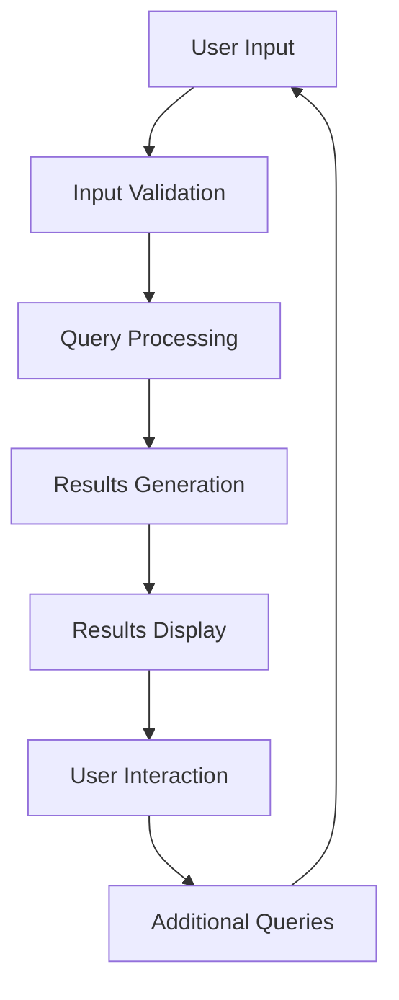
```mermaid
flowchart TD
    A[User Input] --> B[Input Validation]
    B --> C[Query Processing]
    C --> D[Results Generation]
    D --> E[Results Display]
    E --> F[User Interaction]
    F --> G[Additional Queries]
    G --> A
```

## 🎯 Accessibility Design

### 1. **Accessibility Features**

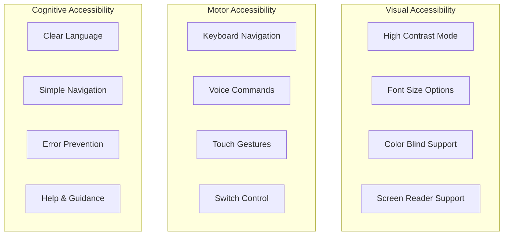
```mermaid
graph TB
    subgraph "Visual Accessibility"
        A[High Contrast Mode]
        B[Font Size Options]
        C[Color Blind Support]
        D[Screen Reader Support]
    end
    
    subgraph "Motor Accessibility"
        E[Keyboard Navigation]
        F[Voice Commands]
        G[Touch Gestures]
        H[Switch Control]
    end
    
    subgraph "Cognitive Accessibility"
        I[Clear Language]
        J[Simple Navigation]
        K[Error Prevention]
        L[Help & Guidance]
    end
```

### 2. **WCAG Compliance**

- **Level AA Compliance**: Meets WCAG 2.1 AA standards
- **Keyboard Navigation**: Full keyboard accessibility
- **Screen Reader Support**: Compatible with screen readers
- **Color Contrast**: Sufficient color contrast ratios
- **Focus Management**: Clear focus indicators

## 🎨 Interactive Elements

### 1. **Button Design**

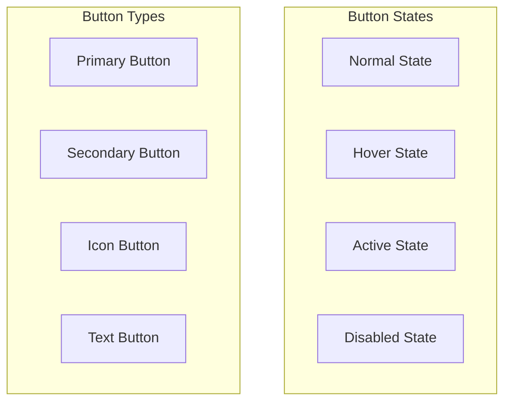
```mermaid
graph TB
    subgraph "Button States"
        A[Normal State]
        B[Hover State]
        C[Active State]
        D[Disabled State]
    end
    
    subgraph "Button Types"
        E[Primary Button]
        F[Secondary Button]
        G[Icon Button]
        H[Text Button]
    end
```

### 2. **Form Elements**

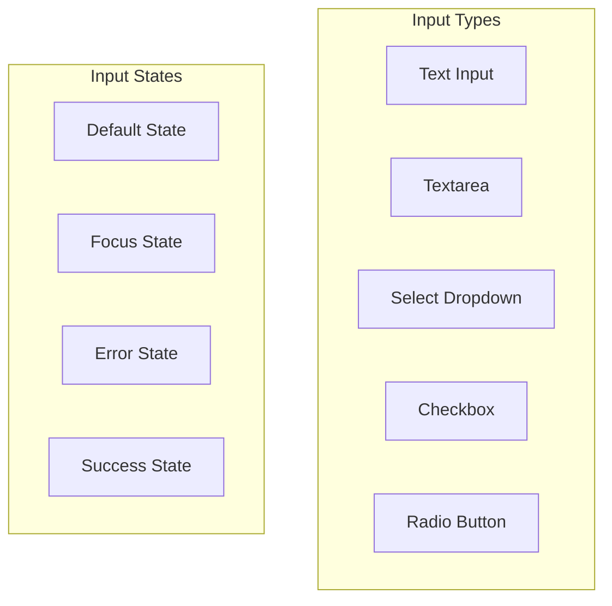
```mermaid
graph TB
    subgraph "Input Types"
        A[Text Input]
        B[Textarea]
        C[Select Dropdown]
        D[Checkbox]
        E[Radio Button]
    end
    
    subgraph "Input States"
        F[Default State]
        G[Focus State]
        H[Error State]
        I[Success State]
    end
```

## 📊 Data Visualization

### 1. **Chart Types**

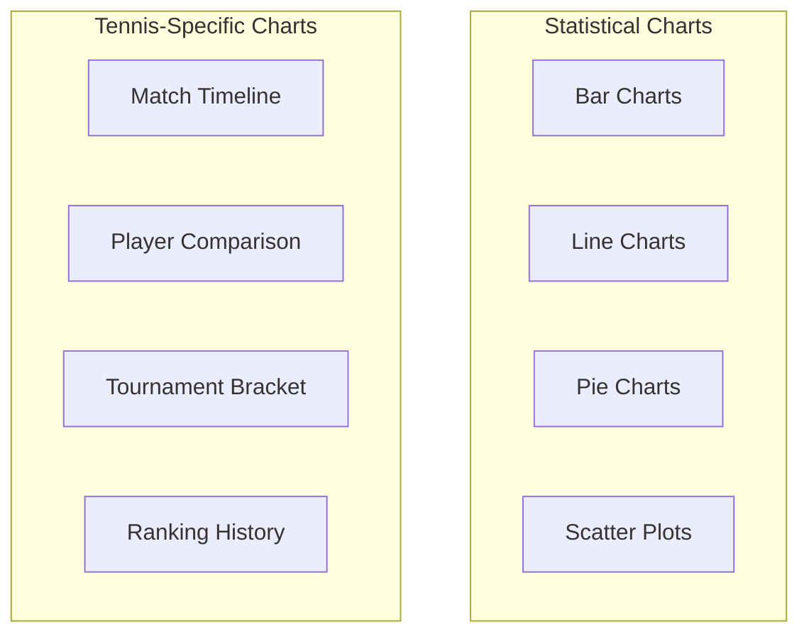
```mermaid
graph TB
    subgraph "Statistical Charts"
        A[Bar Charts]
        B[Line Charts]
        C[Pie Charts]
        D[Scatter Plots]
    end
    
    subgraph "Tennis-Specific Charts"
        E[Match Timeline]
        F[Player Comparison]
        G[Tournament Bracket]
        H[Ranking History]
    end
```

### 2. **Interactive Features**

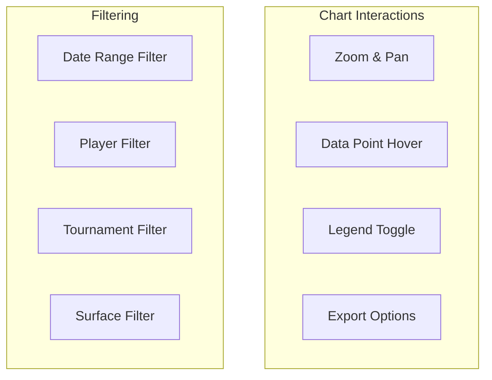
```mermaid
graph TB
    subgraph "Chart Interactions"
        A[Zoom & Pan]
        B[Data Point Hover]
        C[Legend Toggle]
        D[Export Options]
    end
    
    subgraph "Filtering"
        E[Date Range Filter]
        F[Player Filter]
        G[Tournament Filter]
        H[Surface Filter]
    end
```

## 🎨 Animation & Transitions

### 1. **Animation Principles**

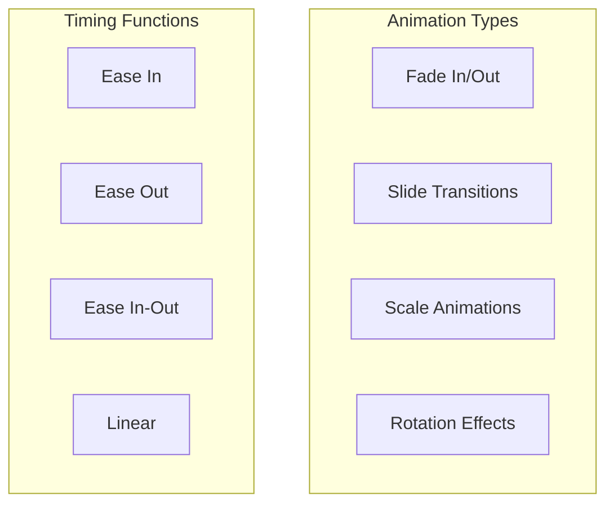
```mermaid
graph TB
    subgraph "Animation Types"
        A[Fade In/Out]
        B[Slide Transitions]
        C[Scale Animations]
        D[Rotation Effects]
    end
    
    subgraph "Timing Functions"
        E[Ease In]
        F[Ease Out]
        G[Ease In-Out]
        H[Linear]
    end
```

### 2. **Performance Considerations**

- **60fps Animations**: Smooth animations at 60 frames per second
- **Hardware Acceleration**: GPU-accelerated animations
- **Reduced Motion**: Respect user preferences for reduced motion
- **Progressive Enhancement**: Animations enhance but don't block functionality

## 🎯 User Interface Patterns

### 1. **Navigation Patterns**

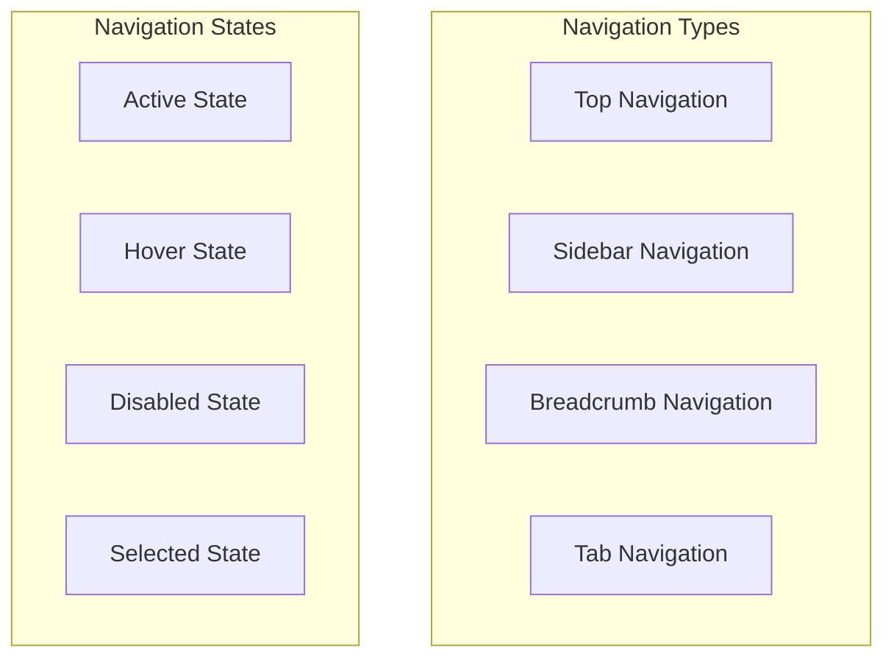
```mermaid
graph TB
    subgraph "Navigation Types"
        A[Top Navigation]
        B[Sidebar Navigation]
        C[Breadcrumb Navigation]
        D[Tab Navigation]
    end
    
    subgraph "Navigation States"
        E[Active State]
        F[Hover State]
        G[Disabled State]
        H[Selected State]
    end
```

### 2. **Content Patterns**

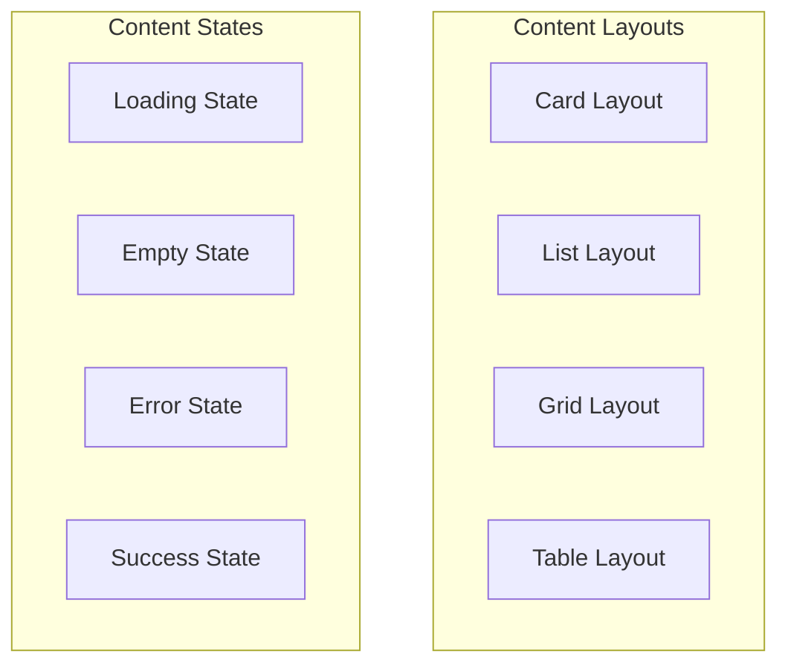
```mermaid
graph TB
    subgraph "Content Layouts"
        A[Card Layout]
        B[List Layout]
        C[Grid Layout]
        D[Table Layout]
    end
    
    subgraph "Content States"
        E[Loading State]
        F[Empty State]
        G[Error State]
        H[Success State]
    end
```

## 📱 Mobile Design Considerations

### 1. **Touch Interface**

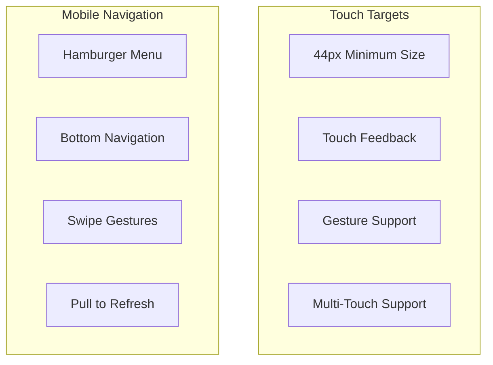
```mermaid
graph TB
    subgraph "Touch Targets"
        A[44px Minimum Size]
        B[Touch Feedback]
        C[Gesture Support]
        D[Multi-Touch Support]
    end
    
    subgraph "Mobile Navigation"
        E[Hamburger Menu]
        F[Bottom Navigation]
        G[Swipe Gestures]
        H[Pull to Refresh]
    end
```

### 2. **Performance Optimization**

```mermaid
graph TB
    subgraph "Mobile Performance"
        A[Lazy Loading]
        B[Image Optimization]
        C[Code Splitting]
        D[Service Workers]
    end
    
    subgraph "Offline Support"
        E[Cache Strategy]
        F[Offline Indicators]
        G[Sync When Online]
        H[Progressive Web App]
    end
```

## 🎨 Design System Implementation

### 1. **Component Library**

```mermaid
graph TB
    subgraph "Base Components"
        A[Button]
        B[Input]
        C[Card]
        D[Modal]
    end
    
    subgraph "Composite Components"
        E[Search Interface]
        F[Results Display]
        G[Data Table]
        H[Chart Container]
    end
    
    subgraph "Layout Components"
        I[Header]
        J[Sidebar]
        K[Footer]
        L[Grid System]
    end
```

### 2. **Design Tokens**

```mermaid
graph TB
    subgraph "Design Tokens"
        A[Colors]
        B[Typography]
        C[Spacing]
        D[Shadows]
        E[Border Radius]
        F[Animation Duration]
    end
    
    subgraph "Token Usage"
        G[Consistent Application]
        H[Theme Support]
        I[Dark Mode Support]
        J[Customization Options]
    end
```

## 🎯 User Testing & Validation

### 1. **Usability Testing**

```mermaid
graph TB
    subgraph "Testing Methods"
        A[User Interviews]
        B[Usability Testing]
        C[A/B Testing]
        D[Analytics Analysis]
    end
    
    subgraph "Testing Metrics"
        E[Task Completion Rate]
        F[Time to Complete]
        G[Error Rate]
        H[User Satisfaction]
    end
```

### 2. **Iterative Improvement**

```mermaid
graph TB
    A[Design] --> B[Prototype]
    B --> C[Test]
    C --> D[Analyze]
    D --> E[Iterate]
    E --> A
```

---

## 🎯 Key UI/UX Design Benefits

1. **User Experience**: Intuitive and engaging user interface
2. **Accessibility**: Inclusive design for all users
3. **Performance**: Fast and responsive interactions
4. **Scalability**: Design system that scales with growth
5. **Consistency**: Cohesive visual identity and interactions
6. **Flexibility**: Adaptable to different use cases and contexts
7. **Innovation**: Modern design patterns and best practices

This UI/UX design documentation ensures that AskTennis AI provides an exceptional user experience while maintaining high functionality, accessibility, and visual appeal.
